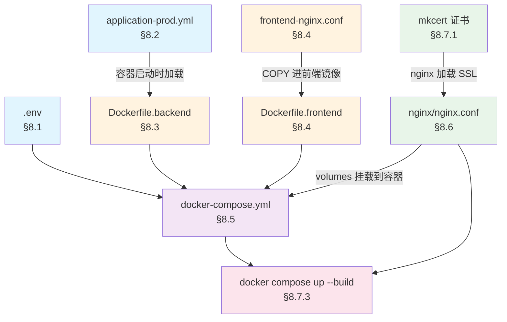

# Part 8：Docker 部署与 CI/CD

---

## 全局视图：文件依赖关系与创建顺序

本章所有文件都在 `java-blog/` 目录下创建。下图展示它们之间的依赖关系——**被引用的文件必须先创建**：



**按依赖顺序，你需要依次创建以下文件（本地练手只需 §8.1-8.7）：**

| 顺序 | 章节 | 文件路径 | 作用 |
|:---:|:---:|---|---|
| 1 | §8.1 | `.env` | 所有服务的配置变量源头 |
| 2 | §8.2 | `backend/.../application-prod.yml` | 后端生产环境 Spring 配置 |
| 3 | §8.3 | `docker/Dockerfile.backend` | 后端镜像构建 |
| 4 | §8.4 | `docker/Dockerfile.frontend` + `docker/frontend-nginx.conf` | 前端镜像构建 |
| 5 | §8.5 | `docker/docker-compose.yml` | 编排所有容器（引用上面 4 个文件） |
| 6 | §8.6 | `nginx/nginx.conf` | Nginx 反向代理（被 compose 挂载） |
| 7 | §8.7 | HTTPS 证书 + 启动 + 验证 | 签证书 → 启动 → 验证跑通 |

> **生产专属内容（本地练手可跳过）**：§8.8 Docker Compose 生产编排、§8.9 GitHub Actions CI/CD。

---

## 8.1 环境变量配置（.env）

> **说明**：创建文件 `.env.example` 并提交到仓库，复制为 `.env` 后修改实际值（`.env` 已在 .gitignore 中）。
> Docker Compose 会自动读取同目录的 `.env` 文件。
> 注意：docker-compose 中通过 `APP_JWT_EXPIRATION` / `APP_JWT_REFRESH_EXPIRATION`
> 环境变量注入 Spring Boot 的 `app.jwt.expiration` / `app.jwt.refresh-exprection`。

```bash
# .env.example

# ---- PostgreSQL ----
PG_USER=bloguser
PG_PASSWORD=blogpass123
PG_DATABASE=blogdb
PG_HOST=localhost
PG_PORT=5432

# ---- Redis ----
REDIS_PASSWORD=redispass123
REDIS_HOST=localhost
REDIS_PORT=6379

# ---- JWT ----
JWT_SECRET=your-super-secret-jwt-key-change-in-production
JWT_EXPIRATION=3600
JWT_REFRESH_EXPIRATION=604800

# ---- Kafka ----
KAFKA_PORT=9092

# ---- 服务端口 ----
BACKEND_PORT=8080
FRONTEND_PORT=3000
HTTP_PORT=80
HTTPS_PORT=443

# ---- 应用 ----
LOG_LEVEL=info
CORS_ORIGIN=http://localhost:3000
# [前端 WS] 构建前端镜像时注入，必须是 wss:// 且经 nginx，否则 HTTPS 页面下聊天被浏览器拦截。
#   WSL 本地 mkcert 场景：CORS_ORIGIN=https://myblog.local，VITE_WS_URL=wss://myblog.local/ws/chat
VITE_WS_URL=wss://myblog.local/ws/chat
```

---

## 8.2 Spring Profile 配置文件

> **说明**：Part 1-3 逐步建立的 `application.yml` 定义了所有环境的公共配置。
> 下方两个文件是**环境专属覆盖配置**，Spring Boot 启动时通过 `--spring.profiles.active` 加载对应文件，
> 其中的配置项会覆盖 `application.yml` 中的同名配置。
> Dockerfile 中已设置 `--spring.profiles.active=prod`（见 §8.3 Dockerfile CMD）。

### 8.2.1 application-dev.yml — 开发环境

```yaml
# backend/src/main/resources/application-dev.yml
# [Spring Profile] 开发环境配置 — 覆盖 application.yml 中的公共配置

spring:
  jpa:
    hibernate:
      ddl-auto: update          # [开发] 自动更新表结构，无需手动运行 Flyway
    show-sql: true              # [开发] 控制台打印 SQL，便于调试

  # [开发] Flyway 在开发环境可选择关闭，Hibernate ddl-auto 已足够
  flyway:
    enabled: false

logging:
  level:
    root: INFO
    com.blog: DEBUG
    org.hibernate.SQL: DEBUG
    org.hibernate.type.descriptor.sql.BasicBinder: TRACE
```

### 8.2.2 application-prod.yml — 生产环境

```yaml
# backend/src/main/resources/application-prod.yml
# [Spring Profile] 生产环境配置 — 覆盖 application.yml 中的公共配置

spring:
  jpa:
    hibernate:
      ddl-auto: validate        # [生产] 只校验不修改，Flyway 负责迁移
    show-sql: false             # [生产] 不打印 SQL

  # [生产] 连接池调大
  datasource:
    hikari:
      maximum-pool-size: 20
      minimum-idle: 10

  flyway:
    enabled: true               # [生产] 必须启用 Flyway

logging:
  level:
    root: WARN
    com.blog: INFO
    org.hibernate.SQL: WARN
```

---

## 8.3 Dockerfile — 后端

```dockerfile
# docker/Dockerfile.backend
# [Docker] 多阶段构建 — Maven 编译阶段 + JRE 运行阶段，减小最终镜像体积

# ---- 阶段 1：编译 ----
# [Docker] 编译阶段 — 必须用自带 Maven 的镜像
# ⚠️ eclipse-temurin:25-jdk 只含 JDK、不含 mvn，直接 RUN mvn 会报 command not found 导致构建失败。
#    builder 阶段改用官方 maven 镜像（内含 JDK 25 + Maven 3.9）；运行阶段仍用精简 JRE。
FROM maven:3.9-eclipse-temurin-25 AS builder

WORKDIR /build

# [Docker] 先复制 pom.xml — 利用 Docker 层缓存加速依赖下载
COPY backend/pom.xml ./
RUN mvn dependency:go-offline -B

# 复制源代码
COPY backend/ ./

# [Maven] 打包为可执行 fat JAR（跳过测试，测试在 CI 阶段单独执行）
RUN mvn package -DskipTests -B

# ---- 阶段 2：运行 ----
# [Docker] 运行阶段 — 只包含 JRE，镜像更小
FROM eclipse-temurin:25-jre-alpine

WORKDIR /app

# 从编译阶段复制 JAR 文件
COPY --from=builder /build/target/blog-backend-*.jar ./app.jar

# 创建日志目录
RUN mkdir -p logs

# [JVM] 优化容器内 JVM 参数
ENV JAVA_OPTS="-Xms256m -Xmx512m -XX:+UseContainerSupport -XX:MaxRAMPercentage=75.0"

EXPOSE 8080

# 健康检查
HEALTHCHECK --interval=30s --timeout=5s --retries=3 \
    CMD wget -qO- http://localhost:8080/api/health || exit 1

# [Docker] 运行 Spring Boot 应用
CMD ["sh", "-c", "java $JAVA_OPTS -jar app.jar --spring.profiles.active=prod"]
```

---

## 8.4 Dockerfile — 前端

```dockerfile
# docker/Dockerfile.frontend
# [Docker] 前端多阶段构建 — Node 编译 + Nginx 托管

# ---- 阶段 1：编译 ----
FROM node:24-alpine AS builder

WORKDIR /app

# [Docker] 先复制 package 文件 — 利用层缓存
COPY frontend/package.json frontend/pnpm-lock.yaml ./

# [pnpm] 安装依赖 — 只在 package.json 变化时重新安装
RUN corepack enable && pnpm install --frozen-lockfile

# 复制源代码
COPY frontend/ ./

# [Vite] 生产构建前注入前端运行时环境变量
# VITE_API_URL：留空即用相对路径 /api（走 nginx 反代，推荐，无需改）
# VITE_WS_URL：WebSocket 地址。HTTPS 部署必须用 wss:// 且经 nginx（如 wss://myblog.local/ws/chat），
#             否则前端默认的 ws://localhost:8080 会被浏览器当作「混合内容」拦截，聊天功能失效。
ARG VITE_API_URL=""
ARG VITE_WS_URL=""
ENV VITE_API_URL=$VITE_API_URL
ENV VITE_WS_URL=$VITE_WS_URL

# [Vite] 生产构建
RUN pnpm build

# ---- 阶段 2：Nginx 托管 ----
FROM nginx:1.27-alpine

COPY --from=builder /app/dist /usr/share/nginx/html
COPY docker/frontend-nginx.conf /etc/nginx/conf.d/default.conf

EXPOSE 80

CMD ["nginx", "-g", "daemon off;"]
```

```nginx
# docker/frontend-nginx.conf
# [Nginx] 前端 SPA 路由配置 — 所有路径返回 index.html
server {
    listen 80;
    root /usr/share/nginx/html;
    index index.html;

    location / {
        try_files $uri $uri/ /index.html;
    }

    location /assets/ {
        expires 1y;
        add_header Cache-Control "public, immutable";
    }
}
```

---

## 8.5 Docker Compose 编排（开发环境）

> **说明**：开发阶段一直用 `docker run` 单独管理 Postgres/Redis 容器（Part 2 引入）。
> 到部署阶段才创建编排文件，把所有服务统一管理。创建文件 `docker/docker-compose.yml`：

```yaml
# docker/docker-compose.yml
# [Docker Compose] 多容器编排，一键启动所有服务

networks:
  blog-network:
    driver: bridge

volumes:
  pg-data:
    driver: local
  redis-data:
    driver: local
  kafka-data:
    driver: local

services:
  # ---- PostgreSQL 17 主数据库 ----
  postgres:
    image: postgres:17-alpine
    container_name: blog-postgres
    restart: unless-stopped
    environment:
      POSTGRES_USER: ${PG_USER:-bloguser}
      POSTGRES_PASSWORD: ${PG_PASSWORD:-blogpass123}
      POSTGRES_DB: ${PG_DATABASE:-blogdb}
    ports:
      - "${PG_PORT:-5432}:5432"
    volumes:
      - pg-data:/var/lib/postgresql/data
    networks:
      - blog-network
    healthcheck:
      test: ["CMD-SHELL", "pg_isready -U ${PG_USER:-bloguser} -d ${PG_DATABASE:-blogdb}"]
      interval: 10s
      timeout: 5s
      retries: 5

  # ---- Redis 7 缓存 ----
  redis:
    image: redis:7-alpine
    container_name: blog-redis
    restart: unless-stopped
    command: redis-server --requirepass ${REDIS_PASSWORD:-redispass123} --appendonly yes
    ports:
      - "${REDIS_PORT:-6379}:6379"
    volumes:
      - redis-data:/data
    networks:
      - blog-network
    healthcheck:
      test: ["CMD", "redis-cli", "-a", "${REDIS_PASSWORD:-redispass123}", "ping"]
      interval: 10s
      timeout: 5s
      retries: 5

  # ---- Kafka（KRaft 模式，无需 ZooKeeper） ----
  # Part 7 引入的事件驱动中间件，SearchIndexer / NotifyWorker / KafkaEventProducer 均依赖它。
  # 所有 KRaft 参数与 Part 7 §7.2.1 的 docker run 命令完全一致，compose 统一管理后无需手动输入。
  kafka:
    image: apache/kafka:latest
    container_name: blog-kafka
    restart: unless-stopped
    ports:
      - "${KAFKA_PORT:-9092}:9092"
    environment:
      KAFKA_NODE_ID: 1
      KAFKA_PROCESS_ROLES: broker,controller
      KAFKA_LISTENERS: PLAINTEXT://:9092,CONTROLLER://:9093
      # [Kafka] compose 内部用服务名 kafka 通信，外部（宿主机调试）用 localhost
      KAFKA_ADVERTISED_LISTENERS: PLAINTEXT://kafka:9092
      KAFKA_CONTROLLER_LISTENER_NAMES: CONTROLLER
      KAFKA_LISTENER_SECURITY_PROTOCOL_MAP: CONTROLLER:PLAINTEXT,PLAINTEXT:PLAINTEXT
      KAFKA_CONTROLLER_QUORUM_VOTERS: 1@kafka:9093
      KAFKA_OFFSETS_TOPIC_REPLICATION_FACTOR: 1
      KAFKA_TRANSACTION_STATE_LOG_REPLICATION_FACTOR: 1
      KAFKA_TRANSACTION_STATE_LOG_MIN_ISR: 1
      KAFKA_GROUP_INITIAL_REBALANCE_DELAY_MS: 0
      KAFKA_NUM_PARTITIONS: 3
    volumes:
      - kafka-data:/tmp/kraft-combined-logs
    networks:
      - blog-network
    healthcheck:
      test: ["CMD-SHELL", "/opt/kafka/bin/kafka-broker-api-versions.sh --bootstrap-server localhost:9092 || exit 1"]
      interval: 15s
      timeout: 10s
      retries: 5
      start_period: 30s

  # ---- Java 后端服务（Spring Boot） ----
  backend:
    build:
      context: ..
      dockerfile: docker/Dockerfile.backend
    container_name: blog-backend
    restart: unless-stopped
    environment:
      - SPRING_DATASOURCE_URL=jdbc:postgresql://postgres:5432/${PG_DATABASE:-blogdb}
      - SPRING_DATASOURCE_USERNAME=${PG_USER:-bloguser}
      - SPRING_DATASOURCE_PASSWORD=${PG_PASSWORD:-blogpass123}
      - SPRING_DATA_REDIS_HOST=redis
      - SPRING_DATA_REDIS_PORT=6379
      - SPRING_DATA_REDIS_PASSWORD=${REDIS_PASSWORD:-redispass123}
      - SPRING_KAFKA_BOOTSTRAP_SERVERS=kafka:9092
      - JWT_SECRET=${JWT_SECRET:-your-super-secret-jwt-key-change-in-production}
      - APP_JWT_EXPIRATION=${JWT_EXPIRATION:-3600}
      - APP_JWT_REFRESH_EXPIRATION=${JWT_REFRESH_EXPIRATION:-604800}
      - CORS_ORIGIN=${CORS_ORIGIN:-https://myblog.local:4443}
      # [AI] Ollama 跑在宿主机：容器内 localhost 指向容器自己，连不到宿主机 11434，
      #      必须用 Docker Desktop 提供的宿主机特殊域名覆盖（relaxed binding 对应 app.ai.providers.ollama.base-url）
      - APP_AI_PROVIDERS_OLLAMA_BASEURL=http://host.docker.internal:11434
    ports:
      - "${BACKEND_PORT:-8080}:8080"
    depends_on:
      postgres:
        condition: service_healthy
      redis:
        condition: service_healthy
      kafka:
        condition: service_healthy
    networks:
      - blog-network

  # ---- React 前端 ----
  frontend:
    build:
      context: ..
      dockerfile: docker/Dockerfile.frontend
      args:
        # [Vite] 构建时注入 WS 地址：经 nginx 反代到后端 /ws/chat。
        #        HTTPS 场景（mkcert）必须是 wss://；纯 HTTP 场景改成 ws://myblog.local/ws/chat
        VITE_WS_URL: ${VITE_WS_URL:-wss://myblog.local:4443/ws/chat}
    container_name: blog-frontend
    restart: unless-stopped
    networks:
      - blog-network

  # ---- Nginx 反向代理 ----
  nginx:
    image: nginx:1.27-alpine
    container_name: blog-nginx
    restart: unless-stopped
    ports:
      - "${HTTP_PORT:-8081}:80"
      - "${HTTPS_PORT:-4443}:443"
    volumes:
      - ../nginx/nginx.conf:/etc/nginx/nginx.conf:ro
      - ../nginx/ssl:/etc/nginx/ssl:ro
    depends_on:
      - backend
      - frontend
    networks:
      - blog-network
```

> **注意**：`backend`、`frontend` 服务引用的 Dockerfile 见 §8.3/§8.4，`nginx` 挂载配置见 §8.6。
> 若之前已用 `docker run` 启动过同名容器，需先删除：`docker rm -f blog-postgres blog-redis kafka`。

---

## 8.6 Nginx 反向代理配置

```nginx
# nginx/nginx.conf
# [Nginx] 反向代理 + 静态文件 + WebSocket 升级 + SSL + gzip

worker_processes auto;

events {
    worker_connections 4096;
    use epoll;
    multi_accept on;
}

http {
    resolver 127.0.0.11 valid=10s;
    include /etc/nginx/mime.types;
    default_type application/octet-stream;

    log_format main '$remote_addr - $remote_user [$time_local] "$request" '
                    '$status $body_bytes_sent "$http_referer" '
                    '"$http_user_agent" "$http_x_forwarded_for" '
                    'rt=$request_time';

    access_log /var/log/nginx/access.log main;
    error_log /var/log/nginx/error.log warn;

    sendfile on;
    tcp_nopush on;
    tcp_nodelay on;
    keepalive_timeout 65;
    types_hash_max_size 2048;
    client_max_body_size 10M;

    gzip on;
    gzip_vary on;
    gzip_proxied any;
    gzip_comp_level 6;
    gzip_types text/plain text/css application/json application/javascript
               text/xml application/xml application/xml+rss text/javascript
               image/svg+xml;

    add_header X-Frame-Options "SAMEORIGIN" always;
    add_header X-Content-Type-Options "nosniff" always;
    add_header X-XSS-Protection "1; mode=block" always;
    add_header Referrer-Policy "strict-origin-when-cross-origin" always;
    add_header Content-Security-Policy "default-src 'self'; script-src 'self' 'unsafe-inline'; style-src 'self' 'unsafe-inline'; img-src 'self' data: https:; font-src 'self' data:; connect-src 'self' ws: wss:;" always;
    add_header Permissions-Policy "camera=(), microphone=(), geolocation=()" always;

    server {
        listen 80;
        server_name your-domain.com www.your-domain.com;

        location /.well-known/acme-challenge/ {
            root /var/www/certbot;
        }

        location / {
            return 301 https://$server_name$request_uri;
        }
    }

    server {
        listen 443 ssl http2;
        server_name your-domain.com www.your-domain.com;

        ssl_certificate /etc/letsencrypt/live/your-domain.com/fullchain.pem;
        ssl_certificate_key /etc/letsencrypt/live/your-domain.com/privkey.pem;

        ssl_protocols TLSv1.2 TLSv1.3;
        ssl_ciphers ECDHE-ECDSA-AES128-GCM-SHA256:ECDHE-RSA-AES128-GCM-SHA256;
        ssl_prefer_server_ciphers off;
        ssl_session_cache shared:SSL:10m;
        ssl_session_timeout 10m;

        add_header Strict-Transport-Security "max-age=31536000; includeSubDomains" always;

        location / {
            proxy_pass http://frontend:80;
            proxy_set_header Host $host;
            proxy_set_header X-Real-IP $remote_addr;
            proxy_set_header X-Forwarded-For $proxy_add_x_forwarded_for;
            proxy_set_header X-Forwarded-Proto $scheme;
        }

        # [Nginx] /api 路径 — 代理到 Spring Boot 后端
        location /api/ {
            proxy_pass http://backend:8080;
            proxy_set_header Host $host;
            proxy_set_header X-Real-IP $remote_addr;
            proxy_set_header X-Forwarded-For $proxy_add_x_forwarded_for;
            proxy_set_header X-Forwarded-Proto $scheme;

            proxy_connect_timeout 30s;
            proxy_send_timeout 60s;
            proxy_read_timeout 60s;
        }

        # [Nginx] WebSocket 升级 — HTTP → WebSocket 协议转换
        location /ws/ {
            proxy_pass http://backend:8080;
            proxy_http_version 1.1;

            proxy_set_header Upgrade $http_upgrade;
            proxy_set_header Connection "upgrade";

            proxy_set_header Host $host;
            proxy_set_header X-Real-IP $remote_addr;
            proxy_set_header X-Forwarded-For $proxy_add_x_forwarded_for;

            proxy_read_timeout 3600s;
            proxy_send_timeout 3600s;
        }

        location /api/health {
            proxy_pass http://backend:8080;
            access_log off;
        }
    }
}
```

---

## 8.7 HTTPS 证书签发、启动与验证

> §8.6 `nginx.conf` 的 443 server 块引用了 SSL 证书，nginx 加载不到证书就**无法启动**。首次部署前必须先备好证书。
> 本地练手用 **mkcert** 自签证书即可，无需公网域名。

### 8.7.1 本地方式：mkcert 自签证书（WSL 服务器 + Windows 浏览器访问）

> **关键原则**：mkcert 会先建一个本地 CA、再用它签证书，**浏览器必须信任这个 CA** HTTPS 才会显示安全锁。
> 本场景是「WSL 当服务器、Windows 浏览器访问」，所以 **CA 必须被 Windows 信任**——只在 WSL 里 `mkcert -install` 不够（那只写进 Linux 信任库）。
> 证书放在项目 `java-blog/nginx/ssl/` 即可：该目录在 Windows 的 D: 盘，WSL 通过 `/mnt/d/...` 看到的是同一份文件，§8.5 的 compose 已把它挂载到容器 `/etc/nginx/ssl`。

**推荐：在 Windows 侧生成（一步到位，浏览器自动信任）**

因为项目就在 Windows 文件系统上，直接在 Windows 生成证书最省事：

```powershell
# 1. Windows PowerShell 安装 mkcert
winget install FiloSottile.mkcert
#    装完重开一个 PowerShell 让 PATH 生效

# 2. 让 Windows 信任 mkcert 的本地 CA（可能弹 UAC，点「是」）
mkcert -install

# 3. 建目录并签发（域名用 myblog.local，可自行改）
mkdir D:\Program\Java\blog-project\java-blog\nginx\ssl -Force
cd D:\Program\Java\blog-project\java-blog\nginx\ssl
mkcert myblog.local localhost 127.0.0.1
#    产出：myblog.local+2.pem（证书）与 myblog.local+2-key.pem（私钥）

# 4. 让 Windows 能解析 myblog.local（需以管理员身份运行 PowerShell）
#    步骤 1：先查看当前 hosts 文件内容
#    Get-Content "C:\Windows\System32\drivers\etc\hosts"
#
#    步骤 2：用记事本打开编辑（管理员权限的 PowerShell 中执行）
#    notepad "C:\Windows\System32\drivers\etc\hosts"
#    在文件末尾追加一行：
#    127.0.0.1  myblog.local
#    保存并关闭记事本
#
#    步骤 3：再次查看，确认追加成功
#    Get-Content "C:\Windows\System32\drivers\etc\hosts"
```

#### 证书与信任的关系：谁需要信任谁（重要）

很多人以为「Windows 生成的证书要让 WSL 服务器也信任」，其实**不需要**。理清 mkcert 产出的两类东西就明白了：

| 产物 | 作用 | 谁需要它 |
|---|---|---|
| **CA 根证书**（rootCA，在 `mkcert -CAROOT` 目录） | 用来"盖章"签发服务器证书 | **只有浏览器（客户端）需要信任它** |
| **服务器证书 + 私钥**（`myblog.local+2.pem` / `+2-key.pem`） | nginx 对外出示，证明"我是 myblog.local" | **nginx（服务端）只需这两个文件**，不做任何信任校验 |

所以：

- **信任只发生在客户端一侧**：在 Windows 执行的 `mkcert -install` 已把 CA 根证书装进 Windows 信任库，Windows 浏览器就信任了 → 显示安全锁。**这一步就够了。**
- **WSL / nginx 服务端不需要信任任何东西**：nginx 只是把证书+私钥"展示"给浏览器，它自己不校验证书。所以 **WSL 里完全不需要再 `mkcert -install`**。
- **Windows 证书如何"到达"WSL 里的 nginx 容器**：靠的不是信任，而是**文件共享**——证书在 D: 盘的 `java-blog\nginx\ssl\`，WSL 通过 `/mnt/d/...` 看到同一份文件，compose 又把 `../nginx/ssl` 挂载进容器的 `/etc/nginx/ssl`。文件到位即可，无需任何信任操作。

> **唯一例外**：若想在 **WSL 内部**用 `curl https://myblog.local` 测试（而非 Windows 浏览器），那 WSL 的 curl 也需信任 CA，否则报证书错误——此时要么在 WSL 里也 `mkcert -install`，要么临时用 `curl -k` 跳过校验。用 Windows 浏览器访问则不需要这一步。

### 8.7.2 从证书到跑起来的完整步骤

§8.1-8.6 的所有文件已创建完毕，按下述顺序启动并验证：

1. **修改 `nginx/nginx.conf`**：取 §8.6 内容，做五处本地化修改——① 两处 `server_name your-domain.com www.your-domain.com;`（80 与 443）改为 `server_name myblog.local;`；② `ssl_certificate` 改为 `/etc/nginx/ssl/myblog.local+2.pem`；③ `ssl_certificate_key` 改为 `/etc/nginx/ssl/myblog.local+2-key.pem`；④ 删除 `location /.well-known/acme-challenge/ { root /var/www/certbot; }` 段（本地无 certbot）；⑤ 80 端口 server 块的 `return 301 https://$server_name$request_uri;` 改为 `return 301 https://$server_name:4443$request_uri;`（本地 HTTPS 走 4443 端口，规避 Windows 对 443 的占用）。
2. **确认 `docker/` 下 4 个文件已创建**：`Dockerfile.backend`（§8.3）、`Dockerfile.frontend`（§8.4）、`frontend-nginx.conf`（§8.4）、`docker-compose.yml`（§8.5）。
3. **确认 `.env` 已创建**（§8.1，按本地端口方案修改）：`HTTP_PORT=8081`、`HTTPS_PORT=4443`、`CORS_ORIGIN=https://myblog.local:4443`、`VITE_WS_URL=wss://myblog.local:4443/ws/chat`（本地用 8081/4443 规避 Windows Hyper-V/WinNAT 对 80/443 的占用）。
4. **确认 `application-prod.yml` 已创建**（§8.2.2）：`ddl-auto: validate` + Flyway 启用。§8.3 的 `docker/Dockerfile.backend` 最后一行 `CMD` 已带 `--spring.profiles.active=prod`，容器启动时 Spring Boot 会自动加载此文件，首次启动由 Flyway 建表。
5. **清理旧容器**（Part 2/7 用 `docker run` 起过的同名容器会与 compose 冲突）：
   ```powershell
   docker rm -f blog-postgres blog-redis kafka
   ```
6. **构建并启动**（在 `java-blog` 目录下，用 `--env-file` 显式指定避免 .env 找不到）：
   ```powershell
   cd D:\Program\Java\blog-project\java-blog
   docker compose --env-file .env -f docker/docker-compose.yml up -d --build
   ```
7. **验证**：
   ```powershell
   docker compose -f docker/docker-compose.yml ps
   docker compose -f docker/docker-compose.yml logs -f backend
   ```
   后端日志出现 `Started Application` 且无 `validate` 报错后，Windows 浏览器访问 **`https://myblog.local:4443`**：显示安全锁 + 前端页面即成功；聊天页能连上 `wss://myblog.local:4443/ws/chat` 说明 WebSocket 经 nginx 升级成功。

8. **停止服务**（保留容器和数据卷，下次 `up` 秒启）：
   ```powershell
   docker compose -f docker/docker-compose.yml stop
   ```
   **彻底销毁**（删除容器 + 数据卷，相当于重来）：
   ```powershell
   docker compose -f docker/docker-compose.yml down -v
   ```

> **三者区别**：
> | 命令 | 容器 | 数据卷 | 效果 |
> |---|---|---|---|
> | `stop` | 暂停（还在） | 保留 | `up` 秒恢复 |
> | `down` | 删除 | 保留 | 重建容器，数据库数据保留 |
> | `down -v` | 删除 | 删除 | 完全重置，数据库清空 |

> **说明**：compose 使用全新数据卷 `pg-data`，与 Part 2 `docker run` 的旧数据不共享，数据库从空开始由 Flyway 迁移建表，属正常现象。

---

# 后续非必须，可自行查看

---

### 8.7.3 生产方式：Let's Encrypt 免费证书（需真实公网服务器）

> 本地练手**跳过本节**。
> §8.8 的 `certbot` 服务只负责**自动续期**（每 12h 跑一次 `certbot renew`）；首次仍需手动签发一次。以下命令在**域名已解析、80 端口公网可达**的生产服务器上执行，WSL 本地无法完成。

```bash
# 方式 A：宿主机 standalone（签发时临时占用 80 端口，需先停掉占用 80 的容器）
sudo apt install -y certbot
sudo certbot certonly --standalone -d your-domain.com -d www.your-domain.com

# 方式 B：复用 §8.8 的 certbot 容器 + webroot（与 nginx.conf 的 /.well-known/acme-challenge/ 一致）
docker compose -f docker/docker-compose.prod.yml run --rm certbot \
    certonly --webroot -w /var/www/certbot -d your-domain.com -d www.your-domain.com

# 证书文件位置（certbot-conf 卷内）：
#   /etc/letsencrypt/live/your-domain.com/fullchain.pem
#   /etc/letsencrypt/live/your-domain.com/privkey.pem

# 续期演练（正式续期由 certbot 服务自动执行）：
sudo certbot renew --dry-run
```

---

## 8.8 Docker Compose 生产编排（生产专属，本地可跳过）

> **WSL / 本地练手请跳过本文件**：其中的 `certbot` 服务、`certbot-conf/www` 卷、443 的 Let's Encrypt 证书都依赖真实公网域名，本地无法使用。
> 本地部署请用 §8.5 的 `docker-compose.yml`——它已把宿主机 `nginx/ssl/` 挂载到容器 `/etc/nginx/ssl`，配合 §8.7.1「mkcert」即可跑通 HTTPS。本文件仅供真实服务器上线参考。

```yaml
# docker/docker-compose.prod.yml
# [Docker Compose] 生产环境编排 — 资源限制、日志、重启策略

networks:
  blog-network:
    driver: bridge

volumes:
  pg-data:
  redis-data:
  kafka-data:
  certbot-conf:
  certbot-www:

services:
  postgres:
    image: postgres:17-alpine
    restart: always
    environment:
      POSTGRES_USER: ${PG_USER}
      POSTGRES_PASSWORD: ${PG_PASSWORD}
      POSTGRES_DB: ${PG_DATABASE}
    volumes:
      - pg-data:/var/lib/postgresql/data
    networks:
      - blog-network
    deploy:
      resources:
        limits:
          memory: 1G
          cpus: '1.0'
    healthcheck:
      test: ["CMD-SHELL", "pg_isready -U ${PG_USER}"]
      interval: 10s
      timeout: 5s
      retries: 5

  redis:
    image: redis:7-alpine
    restart: always
    command: redis-server --requirepass ${REDIS_PASSWORD} --appendonly yes --maxmemory 256mb --maxmemory-policy allkeys-lru
    volumes:
      - redis-data:/data
    networks:
      - blog-network
    deploy:
      resources:
        limits:
          memory: 512M
          cpus: '0.5'
    healthcheck:
      test: ["CMD", "redis-cli", "-a", "${REDIS_PASSWORD}", "ping"]
      interval: 10s
      timeout: 5s
      retries: 5

  kafka:
    image: apache/kafka:latest
    restart: always
    ports:
      - "${KAFKA_PORT:-9092}:9092"
    environment:
      KAFKA_NODE_ID: 1
      KAFKA_PROCESS_ROLES: broker,controller
      KAFKA_LISTENERS: PLAINTEXT://:9092,CONTROLLER://:9093
      KAFKA_ADVERTISED_LISTENERS: PLAINTEXT://kafka:9092
      KAFKA_CONTROLLER_LISTENER_NAMES: CONTROLLER
      KAFKA_LISTENER_SECURITY_PROTOCOL_MAP: CONTROLLER:PLAINTEXT,PLAINTEXT:PLAINTEXT
      KAFKA_CONTROLLER_QUORUM_VOTERS: 1@kafka:9093
      KAFKA_OFFSETS_TOPIC_REPLICATION_FACTOR: 1
      KAFKA_TRANSACTION_STATE_LOG_REPLICATION_FACTOR: 1
      KAFKA_TRANSACTION_STATE_LOG_MIN_ISR: 1
      KAFKA_GROUP_INITIAL_REBALANCE_DELAY_MS: 0
      KAFKA_NUM_PARTITIONS: 3
    volumes:
      - kafka-data:/tmp/kraft-combined-logs
    networks:
      - blog-network
    deploy:
      resources:
        limits:
          memory: 1G
          cpus: '1.0'
    healthcheck:
      test: ["CMD-SHELL", "/opt/kafka/bin/kafka-broker-api-versions.sh --bootstrap-server localhost:9092 || exit 1"]
      interval: 15s
      timeout: 10s
      retries: 5
      start_period: 30s

  backend:
    build:
      context: ..
      dockerfile: docker/Dockerfile.backend
    restart: always
    environment:
      - SPRING_PROFILES_ACTIVE=prod
      - SPRING_DATASOURCE_URL=jdbc:postgresql://postgres:5432/${PG_DATABASE}
      - SPRING_DATASOURCE_USERNAME=${PG_USER}
      - SPRING_DATASOURCE_PASSWORD=${PG_PASSWORD}
      - SPRING_DATA_REDIS_HOST=redis
      - SPRING_DATA_REDIS_PORT=6379
      - SPRING_DATA_REDIS_PASSWORD=${REDIS_PASSWORD}
      - SPRING_KAFKA_BOOTSTRAP_SERVERS=kafka:9092
      - JWT_SECRET=${JWT_SECRET}
      - APP_JWT_EXPIRATION=${JWT_EXPIRATION}
      - APP_JWT_REFRESH_EXPIRATION=${JWT_REFRESH_EXPIRATION}
      - CORS_ORIGIN=${CORS_ORIGIN}
      # [AI] 同 §8.5：容器内 localhost 连不到宿主机 Ollama，用宿主机特殊域名覆盖
      - APP_AI_PROVIDERS_OLLAMA_BASEURL=http://host.docker.internal:11434
    networks:
      - blog-network
    depends_on:
      postgres:
        condition: service_healthy
      redis:
        condition: service_healthy
      kafka:
        condition: service_healthy
    deploy:
      resources:
        limits:
          memory: 768M
          cpus: '1.0'
      replicas: 2  # [Docker] 后端双副本 — 高可用

  frontend:
    build:
      context: ..
      dockerfile: docker/Dockerfile.frontend
      args:
        VITE_WS_URL: ${VITE_WS_URL:-wss://your-domain.com/ws/chat}
    restart: always
    networks:
      - blog-network

  nginx:
    image: nginx:1.27-alpine
    restart: always
    ports:
      - "80:80"
      - "443:443"
    volumes:
      - ../nginx/nginx.conf:/etc/nginx/nginx.conf:ro
      - certbot-conf:/etc/letsencrypt
      - certbot-www:/var/www/certbot
    depends_on:
      - backend
      - frontend
    networks:
      - blog-network

  certbot:
    image: certbot/certbot
    volumes:
      - certbot-conf:/etc/letsencrypt
      - certbot-www:/var/www/certbot
    entrypoint: "/bin/sh -c 'trap exit TERM; while :; do certbot renew; sleep 12h; done'"
    networks:
      - blog-network
```

---

## 8.9 GitHub Actions CI/CD（生产/CI，本地可跳过）

> **本地练手可跳过本节**：CI/CD 需要把代码推到 GitHub 公开仓库才能用免费 Actions。
> 本地练手时，§8.1-8.7 已经能让你在 WSL 里完整跑通部署流程。

```yaml
# .github/workflows/ci.yml
# [GitHub Actions] CI/CD 流水线 — test → build → deploy

name: Blog Platform CI/CD

on:
  push:
    branches: [main, develop]
  pull_request:
    branches: [main]

env:
  REGISTRY: ghcr.io
  BACKEND_IMAGE: ${{ github.repository }}/backend
  FRONTEND_IMAGE: ${{ github.repository }}/frontend

jobs:
  # ---- 后端测试 ----
  backend-test:
    name: Backend Test
    runs-on: ubuntu-latest
    steps:
      - uses: actions/checkout@v4

      - name: Set up JDK 25
        uses: actions/setup-java@v4
        with:
          java-version: '25'
          distribution: 'temurin'
          cache: 'maven'

      # [测试] 运行后端单元测试
      - name: Run Tests
        run: mvn test -f backend/pom.xml

      - name: Build JAR
        run: mvn package -DskipTests -f backend/pom.xml

  # ---- 前端 Lint + Test ----
  frontend-test:
    name: Frontend Lint & Test
    runs-on: ubuntu-latest
    defaults:
      run:
        working-directory: frontend
    steps:
      - uses: actions/checkout@v4

      - uses: actions/setup-node@v4
        with:
          node-version: '24'

      - uses: pnpm/action-setup@v4
        with:
          version: 11

      - name: Install dependencies
        run: pnpm install --frozen-lockfile

      - name: Type Check
        run: pnpm tsc --noEmit

      - name: Lint
        run: pnpm lint

      - name: Test
        run: pnpm test --run

      - name: Build
        run: pnpm build

  # ---- Docker Build + Push ----
  docker-build:
    name: Docker Build & Push
    needs: [backend-test, frontend-test]
    if: github.ref == 'refs/heads/main'
    runs-on: ubuntu-latest
    permissions:
      contents: read
      packages: write
    steps:
      - uses: actions/checkout@v4

      - name: Log in to Container Registry
        uses: docker/login-action@v3
        with:
          registry: ${{ env.REGISTRY }}
          username: ${{ github.actor }}
          password: ${{ secrets.GITHUB_TOKEN }}

      - name: Build and push Backend
        uses: docker/build-push-action@v6
        with:
          context: .
          file: docker/Dockerfile.backend
          push: true
          tags: ${{ env.REGISTRY }}/${{ env.BACKEND_IMAGE }}:latest,${{ env.REGISTRY }}/${{ env.BACKEND_IMAGE }}:${{ github.sha }}

      - name: Build and push Frontend
        uses: docker/build-push-action@v6
        with:
          context: .
          file: docker/Dockerfile.frontend
          push: true
          tags: ${{ env.REGISTRY }}/${{ env.FRONTEND_IMAGE }}:latest,${{ env.REGISTRY }}/${{ env.FRONTEND_IMAGE }}:${{ github.sha }}

  # ---- 部署到生产 ----
  deploy:
    name: Deploy to Production
    needs: [docker-build]
    if: github.ref == 'refs/heads/main'
    runs-on: ubuntu-latest
    environment: production
    steps:
      - name: Deploy via SSH
        uses: appleboy/ssh-action@v1
        with:
          host: ${{ secrets.SERVER_HOST }}
          username: ${{ secrets.SERVER_USER }}
          key: ${{ secrets.SSH_PRIVATE_KEY }}
          script: |
            cd /opt/blog-platform
            git pull origin main
            docker compose -f docker/docker-compose.prod.yml pull
            docker compose -f docker/docker-compose.prod.yml up -d --remove-orphans
            docker system prune -f
```
