# Part 1 + Part 2 阶段总结：跟着「注册功能」从零走一遍

> **这份文档换了一种讲法。**
> 旧版是按「技术分层」讲的（先 Maven、再 Spring 容器、再数据库……），那是**框架作者由内往外**的视角，对刚接触 Java 的人非常难读。
> 新版按**你实际开发的样子**讲：从「我要做一个注册功能」开始，缺什么文件就建什么文件，一步步把它补全。每个技术点只说**此刻它帮我们做了什么**，不展开内部原理。
>
> - 正文 = 主线，建议通读。
> - `💡 深挖` = 可选的延伸，**第一遍全部跳过**，等你需要时再回来看。
> - 所有流程图用 **mermaid** 画（能直接渲染，不会乱码）。

---

## 0. 这份文档的结构

| 章节 | 你会看到什么 | 类比 |
|------|-------------|------|
| §1 | 一个 HTTP 请求进门后经过哪几站 | 先看地图 |
| §2 | **主线**：手把手做「注册」功能，自顶向下建 6 个文件 | 盖第一间房 |
| §3 | 主线延伸：做「登录」功能，逼出 JWT / Security / Redis | 装门锁 |
| §4 | 支撑这一切的两个配置文件（pom.xml / application.yml）此刻用法 | 水电清单 |
| §5 | 当前代码里值得注意的几点（已按真实代码核对） | 验房 |
| §6 | 下一步（Part 3）该带着什么问题去写 | 下一间房 |

一句话记住主线顺序：

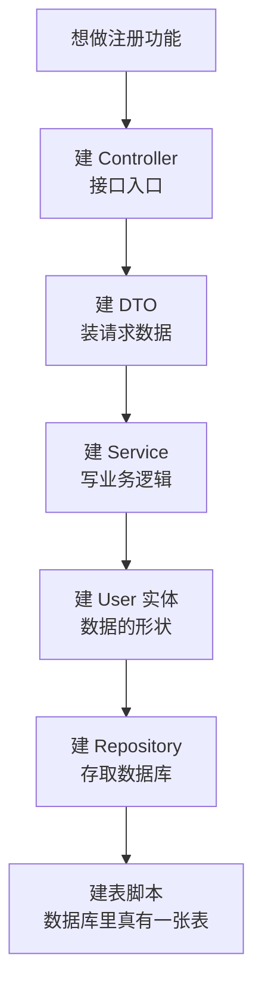

> 这就是你说的「从上往下开发」：先有能接收请求的入口，再一层层往下补，直到数据真正落进数据库。下面我们就按这个顺序走。

---

## 1. 先建立整体印象：一个请求进门后经过哪几站

在你写任何业务代码之前，Spring Boot 已经帮你把「接客」的流水线搭好了。前端发来一个 `POST /api/auth/register`，它依次经过：

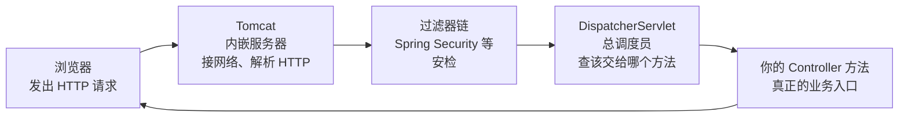

每一站此刻只需要记住一句话：

| 站点 | 它是谁 | 此刻为我们做什么 |
|------|--------|-----------------|
| **Tomcat** | Spring Boot 内嵌的 Web 服务器 | 监听 8080 端口，把网络字节流解析成一个 HTTP 请求对象 |
| **过滤器链** | 一排「安检门」，Spring Security 在这里 | 检查这个请求能不能进（登录接口放行，其他要凭证） |
| **DispatcherServlet** | Spring MVC 的总调度员 | 拿着请求路径去「路由表」里查，找到对应的 Controller 方法 |
| **Controller** | 你写的类 | 真正处理业务的地方 |

> 💡 深挖：路由表是**启动时**扫一遍所有 `@RequestMapping` 建好的（所以改了路径必须重启）；一个请求从头到尾占用 Tomcat 的同一个工作线程（这是后面 `ThreadLocal` 能存当前用户的前提）。这些现在不用管。

**关键结论**：你写业务代码时，只需要关心最后一站「Controller」。前面三站 Spring Boot 已经自动配好了——这就是它「约定优于配置」的意思。

---

## 2. 主线：手把手做「注册」功能

现在我们正式开始做第一个功能：**用户注册**。

想象你就是开发者，需求是「前端 POST 一个用户名/邮箱/密码过来，我要把它存进数据库」。你会怎么一步步建文件？下面每一小节 = 你会新建（或完善）的一个文件。

先看这几个文件之间的关系（这张图是本章的地图，后面每节填一块）：

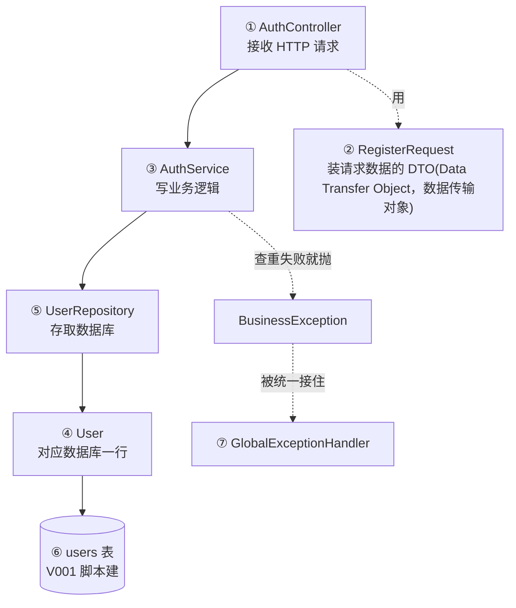

带圈数字 = 我们建文件的顺序。开始。

### 2.1 第一步：我想要一个接口 → 建 `AuthController`

**开发者的想法**：「我得有个地方能接住 `POST /api/auth/register`。」于是建一个 Controller。

```java
@RestController                       // 告诉 Spring：这个类是用来接 HTTP 请求的，返回值直接写成 JSON
@RequestMapping("/api/auth")          // 这个类里所有接口的公共前缀
public class AuthController {

    private final AuthService authService;

    public AuthController(AuthService authService) {   // 构造器注入：Spring 自动把 AuthService 对象塞进来
        this.authService = authService;
    }

    @PostMapping("/register")         // 前缀 + 这里 = POST /api/auth/register
    public ResponseEntity<Map<String, Object>> register(@Valid @RequestBody RegisterRequest request) {
        return ResponseEntity.ok(authService.register(request));   // 活儿交给 Service，自己只负责收发
    }
}
```

此刻每个注解的作用：

| 写法 | 属于什么 | 此刻为我们做什么 |
|------|---------|-----------------|
| `@RestController` | Spring MVC | 标记「这是个 Web 接口类」，且方法返回值自动转成 JSON 响应体 |
| `@RequestMapping("/api/auth")` | Spring MVC | 给这个类的所有接口加统一路径前缀 |
| `@PostMapping("/register")` | Spring MVC | 把「POST 方法 + /register 路径」绑定到这个方法上 |
| `@RequestBody` | Spring MVC | 把请求体里的 JSON 自动转成 `RegisterRequest` 对象 |
| `@Valid` | Bean Validation | 转成对象后，立刻按字段上的规则校验（见下一步） |
| 构造器注入 | Spring 容器 | 你不用 `new AuthService()`，Spring 启动时自动把现成的对象给你 |

> 💡 深挖：为什么 Controller 里几乎不写逻辑，只「转交」给 Service？这是**分层**——Controller 只管「收发 HTTP」，业务规则全放 Service，这样业务逻辑换一种入口（比如定时任务）也能复用。构造器注入相比字段注入的好处（可测试、不可变、能暴露循环依赖）属于进阶话题，现在只需知道「Spring 会帮你把依赖塞进来」。

**这一步之后你拥有了**：一个能接住注册请求的入口。但请求体 `RegisterRequest` 还没定义——下一步补。

### 2.2 第二步：请求体要变成 Java 对象 → 建 `RegisterRequest`（DTO）

**开发者的想法**：「前端发来的是一段 JSON，我要用一个 Java 类来装它，顺便规定哪些字段必填、多长。」

```java
@Data                                  // Lombok：自动生成 getter/setter/toString 等，省去手写
public class RegisterRequest {
    @NotBlank @Size(min = 3, max = 50, message = "Username must be 3-50 chars")
    private String username;

    @NotBlank @Email                   // 必须是邮箱格式
    private String email;

    @NotBlank @Size(min = 8)           // 密码至少 8 位
    private String password;
}
```

前端发来的 JSON 是怎么变成这个对象的：

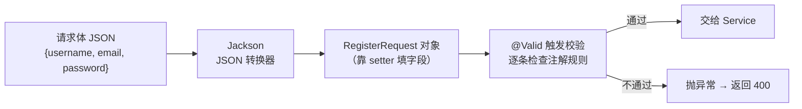

此刻每个写法的作用：

| 写法 | 属于什么 | 此刻为我们做什么 |
|------|---------|-----------------|
| `@Data` | Lombok | 编译时自动生成 getter/setter。**Jackson 靠 setter 把 JSON 填进对象**，所以没有它就转不进来 |
| `@RequestBody` | Spring MVC + Jackson | 触发上面这个「JSON → 对象」的转换 |
| `@NotBlank` | Bean Validation | 字符串不能为 null、空串、纯空格 |
| `@Size(min,max)` | Bean Validation | 长度限制 |
| `@Email` | Bean Validation | 格式必须是邮箱 |
| `@Valid` | Bean Validation | 在 Controller 方法被调用前，把上面这些规则跑一遍 |

> **为什么不直接用 `User` 实体来接请求，非要单独建一个 DTO？**
> 因为注册请求里**只有** username/email/password，而 `User` 有 id、status、createdAt 等一堆字段。如果直接用 User 接收，前端就可能偷偷传一个 `"status":"banned"` 进来把自己设成管理员——这叫**过度绑定漏洞**。DTO 就是「只暴露该暴露的字段」。

> 💡 深挖：`@NotBlank` / `@NotEmpty` / `@NotNull` 三者区别（分别针对字符串、集合、任意对象）；校验失败会抛 `MethodArgumentNotValidException`，我们在 §2.7 统一处理它。

**这一步之后你拥有了**：能接住请求、能校验字段的入口。但「查重、加密、存库」这些真正的业务还没写——下一步进 Service。

### 2.3 第三步：注册的业务逻辑 → 建 `AuthService`

**开发者的想法**：「注册要做三件事：① 用户名/邮箱不能重复 ② 密码要加密 ③ 存进数据库。这些是业务规则，放 Service。」

```java
@Service                               // 告诉 Spring：这是个业务逻辑类，帮我管理它的实例
public class AuthService {

    private final UserRepository userRepository;
    private final PasswordEncoder passwordEncoder;
    // ...构造器注入（同上，Spring 自动塞）

    @Transactional                     // 要么全部成功，要么全部回滚（见下方说明）
    public Map<String, Object> register(RegisterRequest request) {
        // ① 查重：用户名已存在就抛 409
        if (userRepository.findByUsernameAndStatusNot(request.getUsername(), "deleted").isPresent()) {
            throw new BusinessException(409, "Username taken");
        }
        // ① 查重：邮箱已存在就抛 409
        if (userRepository.findByEmailAndStatusNot(request.getEmail(), "deleted").isPresent()) {
            throw new BusinessException(409, "Email registered");
        }
        // ② 加密密码 + 组装 User 对象（用 Builder 链式写法）
        User user = User.builder()
                .username(request.getUsername())
                .email(request.getEmail())
                .passwordHash(passwordEncoder.encode(request.getPassword()))  // 明文 → 密文
                .status("active")
                .bio("")
                .build();
        // ③ 存库
        user = userRepository.save(user);

        return Map.of("message", "Registered", "user_id", user.getId());
    }
}
```

业务逻辑三步：

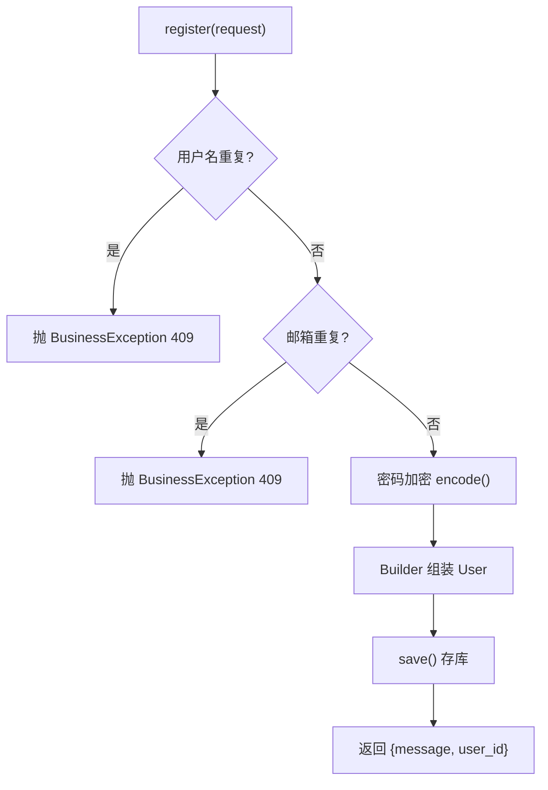

此刻每个写法的作用：

| 写法 | 属于什么 | 此刻为我们做什么 |
|------|---------|-----------------|
| `@Service` | Spring 容器 | 标记业务类，让 Spring 创建并管理它的实例（一个 Bean） |
| `@Transactional` | Spring 事务 | 把整个方法包进一个数据库事务：中途抛异常，已做的数据库操作全部回滚 |
| `passwordEncoder.encode(...)` | Spring Security | 把明文密码用 BCrypt 加密成密文再存，**数据库里永远看不到明文** |
| `User.builder()...build()` | Lombok `@Builder` | 链式创建对象，比一堆 `setXxx()` 好读 |
| `userRepository.save(...)` | Spring Data JPA | 把这个 User 存进数据库（下一步详解） |

> 💡 深挖：`@Transactional` 默认只在抛 `RuntimeException` 时回滚（抛受检异常不回滚）；`encode()` 每次产生的密文都不同（因为加了随机盐），这是正常的，验证时用 `matches()` 而不是「再加密一次比对」。

**这一步之后你拥有了**：完整的注册业务逻辑。但里面用到的 `User` 类和 `userRepository` 还不存在——接下来两步补上。

### 2.4 第四步：用户数据长什么样 → 建 `User` 实体

**开发者的想法**：「我要存用户，得先定义『一个用户』在 Java 里长什么样，以及它对应数据库的哪张表、哪些列。」

```java
@Entity                                // 告诉 JPA：这个类对应数据库里的一张表
@Table(name = "users")                 // 对应哪张表
@Getter @Setter @NoArgsConstructor @AllArgsConstructor @Builder   // Lombok：生成读写方法/构造器/Builder
public class User {
    @Id                                // 主键
    @GeneratedValue(strategy = GenerationType.UUID)   // 主键由 Hibernate 自动生成 UUID
    @Column(columnDefinition = "uuid")                // 数据库列类型是 uuid（必须写，见深挖）
    private UUID id;

    @Column(nullable = false, unique = true, length = 255)
    private String username;

    @Column(nullable = false, unique = true, length = 255)
    private String email;

    @Column(name = "password_hash", nullable = false)  // Java 叫 passwordHash，数据库列叫 password_hash
    private String passwordHash;

    // ... displayName / avatarUrl / bio 等

    @Column(length = 20)
    @Builder.Default                    // 不写这行，Builder 会忽略下面的 "active" 默认值
    private String status = "active";

    @PrePersist                         // 存库前自动调用：填创建/更新时间
    protected void onCreate() {
        createdAt = Instant.now();
        updatedAt = Instant.now();
    }
}
```

Java 类和数据库表的对应关系：

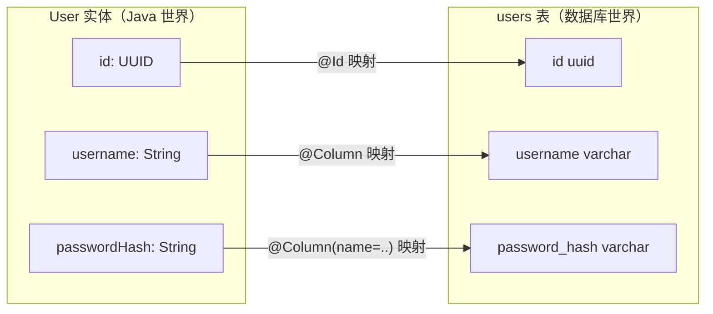

此刻每个写法的作用：

| 写法 | 属于什么 | 此刻为我们做什么 |
|------|---------|-----------------|
| `@Entity` / `@Table` | JPA（规范），Hibernate（实现） | 声明「这个类 = 一张表」，Hibernate 负责真正干活 |
| `@Id` / `@GeneratedValue` | JPA | 标主键，并让主键自动生成（这里是 UUID） |
| `@Column` | JPA | 声明字段的列名、是否可空、是否唯一、长度 |
| `@Getter/@Setter/@Builder` | Lombok | 生成读写方法和 Builder，省手写样板 |
| `@PrePersist` | JPA 生命周期回调 | 存库前自动填时间戳，不用每次手写 |

> 💡 深挖：`columnDefinition = "uuid"` 必须写——否则 `ddl-auto: validate` 会把 UUID 推导成 `bytea` 类型，和数据库实际的 `uuid` 列对不上，启动直接报错。JPA 实体**不要**用 `@Data`（它的 equals/hashCode/toString 在实体上会引发懒加载和性能坑），这里用 `@Getter/@Setter` 是对的。

**这一步之后你拥有了**：数据的「形状」。但还没有「把它存进数据库」的能力——下一步建 Repository。

### 2.5 第五步：怎么存进数据库 → 建 `UserRepository`

**开发者的想法**：「我要能 save、能按邮箱查。但我不想手写 JDBC 连接、SQL、结果集映射。」

```java
@Repository
public interface UserRepository extends JpaRepository<User, UUID> {   // 注意：是 interface，不用写实现！

    // 只写方法名，Spring Data 自动帮你生成查询
    Optional<User> findByUsernameAndStatusNot(String username, String status);
    Optional<User> findByEmailAndStatusNot(String email, String status);

    // ... findByIdAndStatusNot / softDelete / updatePassword 等
}
```

你没写任何实现，为什么能直接用？

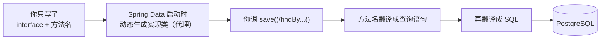

此刻每个写法的作用：

| 写法 | 属于什么 | 此刻为我们做什么 |
|------|---------|-----------------|
| `extends JpaRepository<User, UUID>` | Spring Data JPA | 白送 save / findById / findAll / delete 等一整套 CRUD，一行不用写 |
| `findByEmailAndStatusNot(...)` | Spring Data 方法名派生查询 | **方法名就是查询语句**：Spring 解析「findBy + Email + And + StatusNot」自动生成 `WHERE email=? AND status<>?` |
| `Optional<User>` | Java 标准库 | 查询结果「可能有也可能没有」，用 Optional 包起来，避免 null 判断出错 |
| `@Repository` | Spring 容器 | 标记这是数据访问层（在接口上其实可省，Spring Data 会自动注册） |

> **方法名派生查询是本节最该记住的魔法**：`findByUsernameAndStatusNot` 拆开读就是「find by username AND status NOT equal」。你只要按规则起名字，Spring 就帮你写 SQL。规则关键字还有 `Like`（模糊）、`In`（在集合里）、`OrderBy`（排序）、`CountBy`（计数）等。

> 💡 深挖：`existsByEmail(...)` 比 `findByEmail(...).isPresent()` 更高效（前者只查存在性，后者要把整行捞出来）。Spring Data 在你启动时若方法名拼错会**直接启动失败**并报错，不会拖到运行时。

**这一步之后你拥有了**：存取数据库的能力。但——数据库里现在**根本还没有 users 这张表**。最后一步建表。

### 2.6 第六步：数据库里得先有这张表 → `V001__create_users.sql`

**开发者的想法**：「代码里映射了 users 表，但数据库里得有这张表才行。我用 Flyway 写一个建表脚本，让它启动时自动执行。」

```sql
CREATE TABLE IF NOT EXISTS users (
    id UUID PRIMARY KEY DEFAULT gen_random_uuid(),
    username VARCHAR(255) NOT NULL UNIQUE,
    email VARCHAR(255) NOT NULL UNIQUE,
    password_hash VARCHAR(255) NOT NULL,
    display_name VARCHAR(100),
    avatar_url TEXT,
    bio TEXT DEFAULT '',
    created_at TIMESTAMP WITH TIME ZONE DEFAULT NOW() NOT NULL,
    updated_at TIMESTAMP WITH TIME ZONE DEFAULT NOW() NOT NULL,
    status VARCHAR(20) DEFAULT 'active' CHECK (status IN ('active', 'banned', 'deleted'))
);
CREATE INDEX idx_users_email ON users(email);   -- 按邮箱查很频繁，建索引加速
-- ... 还有 username / created_at 索引，和一个自动更新 updated_at 的触发器
```

Flyway 是怎么工作的：

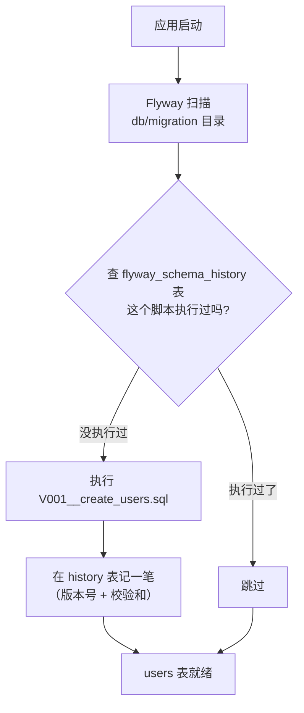

此刻每个写法的作用：

| 写法 | 属于什么 | 此刻为我们做什么 |
|------|---------|-----------------|
| `V001__xxx.sql` 文件名 | Flyway 约定 | `V` = 版本化迁移，`001` = 版本号，双下划线后是描述。Flyway 按版本号顺序执行，且**只执行一次** |
| `CHECK (status IN (...))` | PostgreSQL | 数据库层面的最后防线：status 只能是这三个值之一，写错直接拒绝 |
| `CREATE INDEX` | PostgreSQL | 给常查的列建索引，查询更快 |
| `ddl-auto: validate`（在 yml 里） | Hibernate | 启动时**只校验**「实体和表结构对不对得上」，**不自动改表**——改表这件事交给 Flyway |

> **Flyway 和 Hibernate 的分工**（这是本项目一个重要设计）：
> - **建表/改表** = Flyway 说了算（写 SQL 脚本，可追溯、可版本管理）。
> - **Hibernate `ddl-auto`** 设成 `validate`，只负责「检查代码里的实体和数据库表是否一致」，绝不让它自动改生产库结构。

> 💡 深挖：已经执行过的迁移脚本**不能再改内容**（Flyway 靠校验和发现你改了会报错），要改就新建 `V002__xxx.sql`。这就是为什么后面的功能都是 V002、V003 往上加。

**这一步之后你拥有了**：一张真实的 users 表。注册功能的「数据能落库」闭环打通了。

### 2.7 收尾：出错了怎么优雅返回 → `BusinessException` + `GlobalExceptionHandler`

**开发者的想法**：「查重失败我 `throw` 了异常，校验失败 Spring 也抛了异常。这些异常总不能直接把 Java 堆栈甩给前端吧？我要统一转成干净的 JSON + 合适的状态码。」

```java
// 自定义业务异常：带一个状态码
@Getter
public class BusinessException extends RuntimeException {
    private final int statusCode;
    public BusinessException(int statusCode, String message) {
        super(message);
        this.statusCode = statusCode;
    }
}
```

```java
@RestControllerAdvice                  // 全局异常处理器：所有 Controller 抛的异常都先到这里
public class GlobalExceptionHandler {

    @ExceptionHandler(BusinessException.class)   // 专门接 BusinessException
    public ResponseEntity<Map<String, String>> handleBusiness(BusinessException ex) {
        return ResponseEntity.status(ex.getStatusCode())          // 用它自带的状态码，比如 409
                .body(Map.of("error", ex.getMessage()));
    }

    @ExceptionHandler(MethodArgumentNotValidException.class)       // 专门接 @Valid 校验失败
    public ResponseEntity<Map<String, Object>> handleValidation(MethodArgumentNotValidException ex) {
        // 把每个字段的错误信息收集成一个 map
        Map<String, String> fieldErrors = ex.getBindingResult().getFieldErrors().stream()
                .collect(Collectors.toMap(fe -> fe.getField(), fe -> fe.getDefaultMessage(), (a, b) -> a));
        return ResponseEntity.badRequest()                         // 400
                .body(Map.of("error", "Validation failed", "details", fieldErrors));
    }
}
```

异常怎么被接住并转成响应：

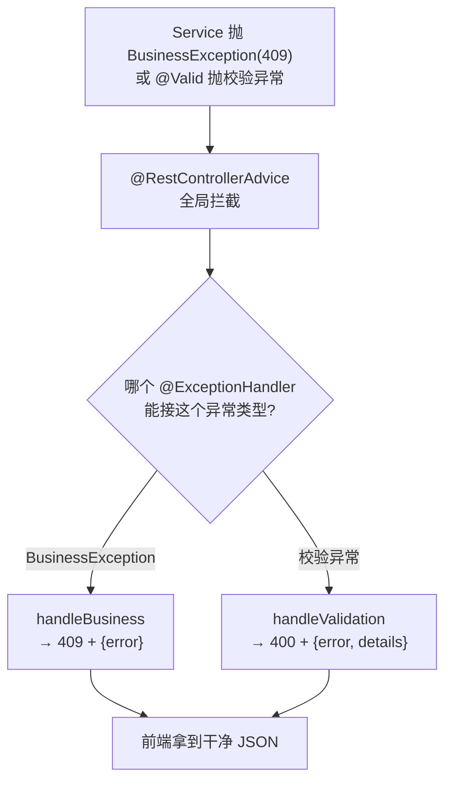

此刻每个写法的作用：

| 写法 | 属于什么 | 此刻为我们做什么 |
|------|---------|-----------------|
| `@RestControllerAdvice` | Spring MVC | 一个「全局异常拦截器」，所有 Controller 抛的异常都先经过它 |
| `@ExceptionHandler(X.class)` | Spring MVC | 声明「我负责处理 X 类型的异常」 |
| `ResponseEntity` | Spring MVC | 能同时控制响应的**状态码**和**响应体** |

> 💡 深挖：这里其实还留了一个通用兜底 `@ExceptionHandler(Exception.class)` 返回 500——它有个副作用（会把本该是 404/405 的情况也压成 500，且没打印异常日志），我在 §5 会点出来。现在先知道「异常会被统一接住转 JSON」即可。

### 2.8 注册功能全景：把上面 7 步串起来

现在回头看，一次成功的注册请求，完整走过这些站：

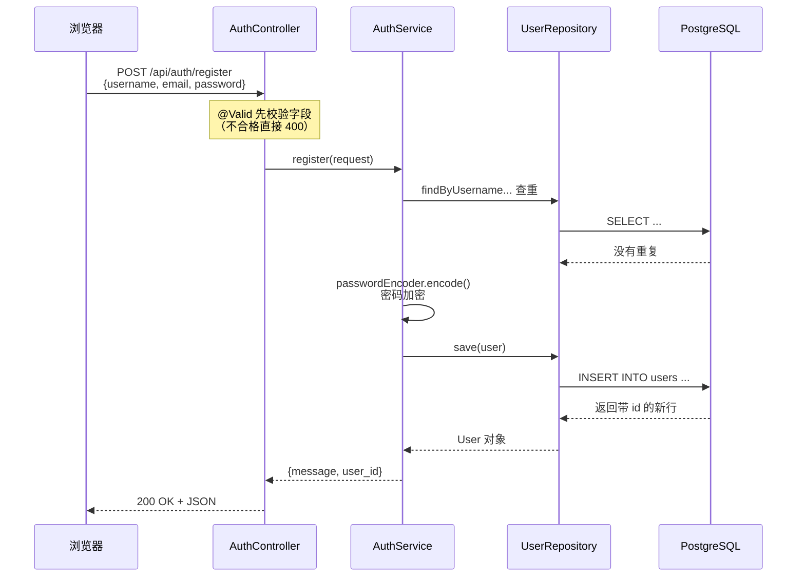

**你现在应该能对着这张图，把注册功能从头讲一遍了。** 这就是本次总结最该达成的目标。

一句话口述模板（可以背下来）：
> 前端 POST 到 `/api/auth/register`，被 Tomcat 接住、过安全过滤器、由 DispatcherServlet 找到 `AuthController.register`；`@Valid` 先校验 `RegisterRequest`；通过后交给 `AuthService.register`，它先用 `UserRepository` 查重，再用 `PasswordEncoder` 加密密码，用 Builder 组装 `User` 实体，`save()` 经 Hibernate 转成 SQL 存进 PostgreSQL 的 users 表；最后返回 `user_id`。任何一步出错就抛异常，由 `GlobalExceptionHandler` 统一转成带状态码的 JSON。

---

## 3. 主线延伸：做「登录」功能（逼出 JWT / Security / Redis）

注册做完，第二个功能自然是**登录**。登录的前半段和注册很像（收请求、查库），但它多了一个注册没有的需求：

> **「验证通过之后，我要发给前端一张凭证，让它之后每次请求都带上，好证明『我是谁』。」**

就是这个「发凭证、认凭证」的新需求，逼出了三个注册时用到的新技术：**JWT**（凭证本身）、**Spring Security**（管安检的框架）、**Redis**（让凭证能作废）。我们同样自顶向下走。

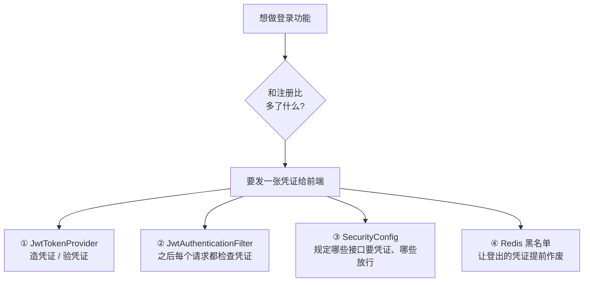

### 3.1 第一步：登录的业务逻辑 → `AuthService.login`

**开发者的想法**：「登录就是：按邮箱查出用户 → 比对密码对不对 → 对了就发凭证。」

```java
public AuthResponse login(LoginRequest request) {
    // ① 按邮箱查用户，查不到就抛 401
    User user = userRepository.findByEmailAndStatusNot(request.getEmail(), "deleted")
            .orElseThrow(() -> new BusinessException(401, "Invalid email or password"));

    // ② 比对密码：matches(明文, 数据库里的密文)
    if (!passwordEncoder.matches(request.getPassword(), user.getPasswordHash())) {
        throw new BusinessException(401, "Invalid email or password");   // 故意和上面同一句话
    }

    // ③ 发两张凭证
    String accessToken  = tokenProvider.generateAccessToken(user.getId().toString(), user.getUsername(), user.getEmail());
    String refreshToken = tokenProvider.generateRefreshToken(user.getId().toString());

    // ④ 组装响应返回
    return AuthResponse.builder()
            .accessToken(accessToken).refreshToken(refreshToken)
            .tokenType("Bearer").expiresIn(3600)
            .user(userMap).build();
}
```

此刻要点：

| 写法 | 此刻为我们做什么 |
|------|-----------------|
| `passwordEncoder.matches(明文, 密文)` | 验证密码。**注意它不是「解密」**，而是把明文用同样的盐再算一遍，比对结果是否一致 |
| 两处都返回 `"Invalid email or password"` | 故意不区分「邮箱不存在」还是「密码错」，防止坏人用报错信息**探测哪些邮箱注册过** |
| `generateAccessToken` / `generateRefreshToken` | 发两张凭证，下一节讲 |

> 💡 深挖：`login` 方法上没加 `@Transactional`（register 加了）。因为登录只是读数据、不写库，不加也能跑；但严格来说加个 `@Transactional(readOnly = true)` 更规范。

### 3.2 第二步：凭证是什么、怎么发 → `JwtTokenProvider`

**开发者的想法**：「凭证不能是随便一串字符——它得装着『这是谁』，还得防止被伪造。我用 JWT。」

**JWT 是什么？** 一句话：**一张签了名的身份卡**。它长这样，用两个点分成三段：

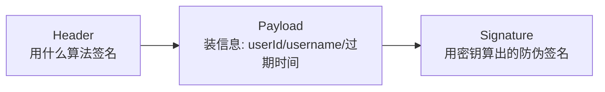

- **Payload** 里装的是「这是谁」（userId、username）和「什么时候过期」——但它是**明文可解码**的，不能放密码等敏感信息。
- **Signature** 是用你服务器独有的密钥算出来的。别人改了 Payload 里的内容（比如把自己改成管理员），签名就对不上，服务器一眼识破。

```java
public String generateAccessToken(String userId, String username, String email) {
    return Jwts.builder()
            .subject(userId)                      // 主体：这张卡是谁的
            .claim("username", username)          // 附加信息
            .claim("email", email)
            .issuedAt(new Date())                 // 签发时间
            .expiration(new Date(System.currentTimeMillis() + expirationMs))  // 过期时间
            .signWith(key)                         // 用密钥签名
            .compact();
}

public boolean isTokenValid(String token) {
    try {
        if (isBlacklisted(token)) return false;   // 先看是不是被拉黑了（登出的）
        validateToken(token);                      // 再验签名和过期时间
        return true;
    } catch (JwtException e) {
        return false;                              // 签名不对 / 过期 → 无效
    }
}
```

**为什么发两张卡（access + refresh）？**

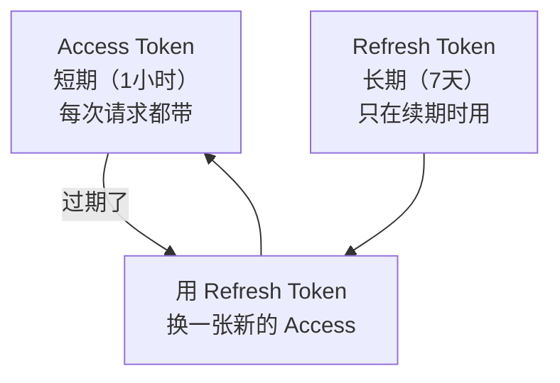

> 一句话理由：Access Token 到处发、风险高，所以让它**短命**；万一泄露，1 小时后自动失效。Refresh Token 藏得深、只在续期时用，可以**长命**，免得用户每小时都要重新登录。

> 💡 深挖：这里用的是 jjwt **0.12 新 API**（`.subject()` / `.verifyWith()` / `.parseSignedClaims()`）。网上大量教程还是 0.11 旧 API（`.setSubject()` / `.parserBuilder()` / `.parseClaimsJws()`），**照抄会编译不过**，注意分辨。签名算法是 HS256（对称密钥），密钥长度必须 ≥ 32 字节，否则启动报 `WeakKeyException`。

### 3.3 第三步：之后每个请求怎么认凭证 → `JwtAuthenticationFilter` + `SecurityConfig`

**开发者的想法**：「登录发了卡，那之后前端带着卡来访问『发帖』『看个人信息』这些接口时，我得在每个请求进来时验一下卡对不对、是谁。」

这件事分两半：**一个过滤器负责验卡**，**一份配置负责规定哪些接口要验卡**。

**① 过滤器 `JwtAuthenticationFilter`：每个请求都先过它**

```java
@Component
public class JwtAuthenticationFilter extends OncePerRequestFilter {   // 保证每个请求只过一次
    protected void doFilterInternal(HttpServletRequest request, ...) {
        String token = extractToken(request);        // 从请求头 Authorization: Bearer xxx 里取出 token

        if (token != null && tokenProvider.isTokenValid(token)) {
            Claims claims = tokenProvider.validateToken(token);
            String userId = claims.getSubject();      // 解出这是谁
            // 把「当前是谁」放进 SecurityContext，后续代码就能取到
            UsernamePasswordAuthenticationToken auth =
                    new UsernamePasswordAuthenticationToken(userId, null, Collections.emptyList());
            SecurityContextHolder.getContext().setAuthentication(auth);
        }
        filterChain.doFilter(request, response);      // 无论验没验过，都放行到下一站（该拦的后面拦）
    }
}
```

**② 配置 `SecurityConfig`：规定安检规则**

```java
@Configuration
@EnableWebSecurity
public class SecurityConfig {
    @Bean
    public SecurityFilterChain filterChain(HttpSecurity http) throws Exception {
        http.cors(...)                                  // 允许前端跨域访问
            .csrf(csrf -> csrf.disable())               // 关掉 CSRF（因为用 JWT，不用 Cookie/Session）
            .sessionManagement(s -> s.sessionCreationPolicy(SessionCreationPolicy.STATELESS))  // 不存 session
            .authorizeHttpRequests(auth -> auth.requestMatchers(
                    "/api/auth/login", "/api/auth/register",
                    "/api/auth/refresh", "/api/health"
                ).permitAll()                            // 这几个接口谁都能访问（登录/注册前本来就没凭证）
                  .anyRequest().authenticated())         // 其他所有接口都必须带有效凭证
            .addFilterBefore(jwtFilter, UsernamePasswordAuthenticationFilter.class);  // 把我们的过滤器插进链里
        return http.build();
    }
}
```

一个带凭证的请求是怎么被验的：

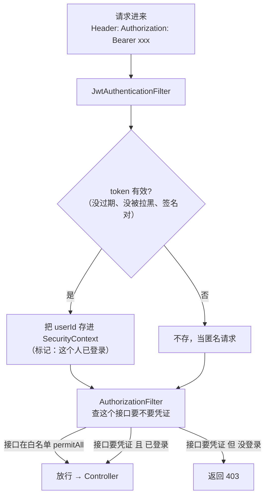

此刻要点：

| 写法 | 此刻为我们做什么 |
|------|-----------------|
| `OncePerRequestFilter` | Spring 提供的基类，保证一个请求只被这个过滤器处理一次 |
| `SecurityContextHolder` | 一个「当前请求是谁」的存放处（基于 ThreadLocal），业务代码里随时能取 |
| `permitAll()` / `authenticated()` | 声明哪些接口放行、哪些必须登录 |
| `addFilterBefore(...)` | 把我们自定义的 JWT 过滤器插进 Spring Security 的过滤器链 |
| `STATELESS` | 服务器**不保存任何会话**，每次请求全靠 token 自证身份（这正是 JWT 方案的核心） |

> 💡 深挖：这里有个容易混的点——**认证（你是谁，失败返回 401）** 由过滤器完成；**授权（你能不能访问，失败返回 403）** 由 `AuthorizationFilter` 完成。另外 `JwtAuthenticationFilter` 上标了 `@Component`，Spring Boot 会额外把它注册成一个全局 Servlet 过滤器，可能和 `addFilterBefore` 重复执行（进阶隐患，见 §5）。

### 3.4 第四步：登出怎么让凭证提前作废 → Redis 黑名单

**开发者的想法**：「用户点登出，我希望他手里那张还没过期的 access token 立刻失效。但 JWT 是无状态的——服务器根本没存它，怎么让它失效？」

这是 JWT 方案的**天生短板**：签出去的卡在过期前一直有效，服务器「不记得」发过哪些卡。解决办法是**存一份黑名单**：

```java
public void blacklistToken(String token) {
    Claims claims = validateToken(token);
    long remaining = claims.getExpiration().getTime() - System.currentTimeMillis();  // 还剩多久过期
    if (remaining > 0) {
        // 把这个 token 存进 Redis，存活时间 = 它剩余的有效期
        redisTemplate.opsForValue().set("session:" + token, "blacklisted", remaining, TimeUnit.MILLISECONDS);
    }
}
```

为什么黑名单要放 Redis，而且 TTL 设成「剩余有效期」：

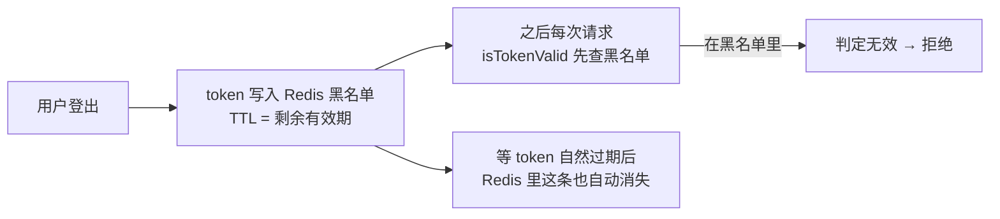

> 一句话理由：
> - **放 Redis** 而不是内存，是因为将来后端要部署多个副本（Part 9 K8s），内存黑名单只在自己这台有效，Redis 是所有副本共享的。
> - **TTL = 剩余有效期**：这张卡本来 1 小时后过期，那黑名单里也只留 1 小时——**正好在它自然失效的那一刻，黑名单记录也自动清掉**，不会无限堆积。

> 💡 深挖：这其实让 JWT 变成了「半无状态」——每个请求都要多查一次 Redis。这是「能主动登出」必须付的代价，属于合理权衡。

### 3.5 登录 + 后续请求全景

把登录、以及登录之后带着凭证访问受保护接口，两件事连起来看：

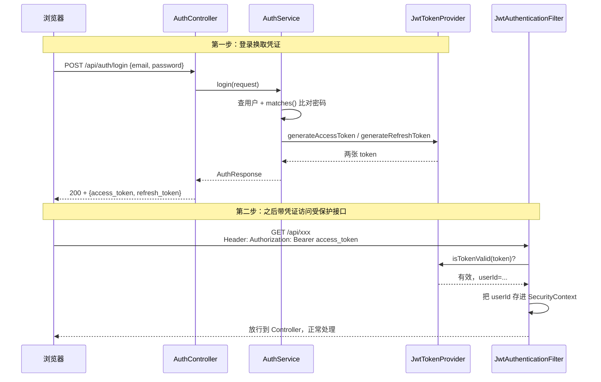

一句话口述模板（登录部分）：
> 前端 POST 到 `/api/auth/login`，`AuthService.login` 按邮箱查出用户、用 `matches()` 比对密码；通过后 `JwtTokenProvider` 用密钥签发 access / refresh 两张 JWT 返回。之后前端每次请求都在 `Authorization: Bearer xxx` 头里带上 access token，`JwtAuthenticationFilter` 验证它（查 Redis 黑名单 + 验签名和过期），有效就把 userId 存进 `SecurityContext`，`SecurityConfig` 里的规则再决定这个接口放不放行。登出时把 token 写进 Redis 黑名单、TTL 设为剩余有效期，让它提前作废。

---

## 4. 支撑这一切的两个配置文件（此刻用法）

前面写的每个功能，背后都靠两个配置文件支撑。你之前的困惑是「这些配置**谁用的、什么时候用的、我怎么知道要有它**」——这一章就回答这三个问题。

### 4.1 `pom.xml`：项目的「购物清单」

**一句话：Maven 是 Java 的「包管理器 + 构建工具」**（类似前端的 npm）。`pom.xml` 就是 `package.json`：你在里面列「我要用哪些库」，Maven 自动帮你下载、并把它们打进最终的 jar。

你项目里的依赖，每一个对应前面用过的一个功能：

| 依赖 | 此刻为你做什么 | 在哪一步用到的 |
|------|--------------|-------------|
| `spring-boot-starter-web` | 内嵌 Tomcat + Spring MVC，提供 `@RestController` 等 | §1 接客、§2.1 Controller |
| `lombok` | 编译时自动生成 getter/setter/Builder | §2.2 `@Data`、§2.4 `@Builder` |
| `spring-boot-devtools` | 开发时改代码自动重启（仅开发环境） | — |
| `spring-boot-starter-data-jpa` | ORM，封装 Hibernate，提供 `JpaRepository` | §2.4 `@Entity`、§2.5 Repository |
| `postgresql` | 连 PostgreSQL 的 JDBC 驱动 | §2.6 存库 |
| `flyway-core` (+postgresql) | 启动时自动执行建表脚本 | §2.6 V001 |
| `spring-boot-starter-security` | 安全框架，提供过滤器链、`PasswordEncoder` | §3.3 安检、§3.1 密码加密 |
| `jjwt-api/impl/jackson` | JWT 令牌的签发与验证 | §3.2 JwtTokenProvider |
| `spring-boot-starter-validation` | 提供 `@Valid` `@NotBlank` 等校验注解 | §2.2 校验字段 |
| `spring-boot-starter-data-redis` | Redis 客户端 | §3.4 黑名单 |

> **我怎么知道要有某个依赖？** 不是背下来的，而是 **「写到那里发现缺了」就去加**：写 `@Entity` 发现报错→加 JPA；写 `Jwts.builder()` 发现报错→加 jjwt。这正是本项目文档「依赖即用即加」的思路。每个 starter 的名字都很直白：`starter-xxx` = 「把 xxx 功能需要的一堆库打包给你」。

> 💡 深挖：`<parent>` 继承的 `spring-boot-starter-parent` 帮你统一管了所有 Spring 依赖的版本（所以大多数依赖不用写 `<version>`）。`lombok` 版本被单独抬到 1.18.46，是因为 JDK 25 需要；`annotationProcessorPaths` 显式声明 Lombok，是因为 JDK 23 起默认不再自动跑注解处理器。`mvn dependency:tree` 能看到完整的依赖树。

### 4.2 `application.yml`：项目的「设置面板」

**一句话：它是 Spring Boot 启动时自动读的主配置文件。** 你写 `server.port: 8080`，Spring Boot 就把服务开在 8080。

里面每一项谁在读：

| 配置 | 谁读它 | 此刻为你做什么 |
|------|--------|--------------|
| `server.port` | 内嵌 Tomcat | 监听哪个端口 |
| `spring.datasource.*` | HikariCP 连接池 | 连哪个数据库、用什么账号密码 |
| `spring.jpa.hibernate.ddl-auto: validate` | Hibernate | 启动时只校验表结构，不自动改表 |
| `spring.flyway.*` | Flyway | 去哪里找迁移脚本 |
| `spring.data.redis.*` | Redis 客户端 | 连哪个 Redis |
| `logging.level.*` | Logback 日志 | 哪个包打什么级别的日志 |
| `app.jwt.*` | **你自己写的** `JwtTokenProvider` | 密钥、过期时间 |
| `app.cors.allowed-origins` | **你自己写的** `SecurityConfig` | 允许哪个前端域名跨域 |

> **关键区别：`spring.*` 是 Spring Boot 官方认识的键**（背后有专门的类去读，写错了 IDE 会黄线提醒）；**`app.*` 是你自己造的键**，只有你自己用 `@Value("${app.jwt.secret}")` 去读它才有效，否则它就只是一段没人理的文字。

两种把配置读进 Java 的写法（本项目两种都用了）：

```java
// 写法 A：@Value 直接注入单个值（JwtTokenProvider 用的）
public JwtTokenProvider(@Value("${app.jwt.secret}") String secret, ...) { ... }

// 写法 B：@Value 注入到字段（SecurityConfig 用的）
@Value("${app.cors.allowed-origins}")
private String allowedOrigins;
```

> 💡 深挖：`${PG_HOST:localhost}` 这种写法叫**占位符**，意思是「先读环境变量 PG_HOST，没有就用默认值 localhost」——这是为了部署时不改代码就能换配置。配置多了可以用 `@ConfigurationProperties` 把一整组绑定成一个对象。

### 4.3 三个角色分别在什么时候被读（回答「谁什么时候用」）

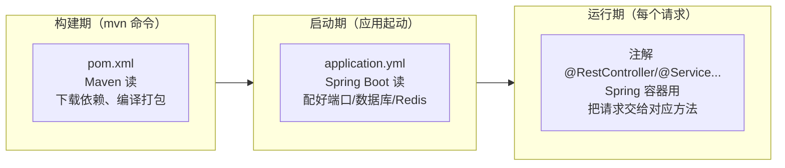

一句话记住：**pom.xml 在构建时被 Maven 读（决定用什么库）；application.yml 在启动时被 Spring Boot 读（决定怎么连外部资源）；代码里的注解在运行时被 Spring 容器用（决定请求怎么流转）。**

### 4.4 启动类 `Application.java`：一切的起点

```java
@SpringBootApplication     // 一个组合注解：自动配置 + 扫描本包及子包下的 @Component/@Service/...
@EnableScheduling          // 开启定时任务支持（目前还没写定时任务，为后续预备）
public class Application {
    public static void main(String[] args) {
        SpringApplication.run(Application.class, args);   // 一行启动整个应用
    }
}
```

> **为什么这个类必须放在根包 `com.blog` 下？** 因为 `@SpringBootApplication` 会从**它所在的包**开始往下扫描。如果把它移到 `com.blog.config` 下，那 `com.blog.controller` 就和它「平级」而非「子级」，扫不到，接口会静悄悄地 404。

### 4.5 最短的一条链路：健康检查 `HealthController`

```java
@RestController
@RequestMapping("/api")
public class HealthController {
    @GetMapping("/health")               // GET /api/health
    public ResponseEntity<Map<String, Object>> health() {
        return ResponseEntity.ok(Map.of("status", "UP", ...));   // 不碰数据库，直接返回
    }
}
```

它是**最简单的一条完整链路**：`GET /api/health` → 在白名单里（不用凭证）→ DispatcherServlet 找到方法 → 直接返回 JSON。想验证「服务活着没」就访问它。

### 4.6 已经埋下、但还没真正用到的东西（诚实说明）

代码里有几个类已经写好，但在目前的注册/登录流程里**还没被真正调用**。先知道它们的存在和用途，免得你以为自己漏看了什么：

| 类/方法 | 现状 | 何时会用到 |
|--------|------|----------|
| `CustomUserDetailsService` | 已定义但**登录流程没走它**（login 直接调 Repository 而非通过 AuthenticationManager） | 如果将来改成标准的 `AuthenticationManager` 认证流程会用到 |
| `RedisConfig.redisTemplate` | 自定义了一个 JSON 序列化的模板，但 JWT 黑名单用的是自动配置的 `StringRedisTemplate` | Part 4 聊天缓存会用这个 JSON 模板 |
| `@EnableScheduling` | 开了定时任务开关，但还没写任何 `@Scheduled` 方法 | 将来做「定时清理过期数据」之类会用到 |
| `UserRepository.softDelete/updatePassword` | 定义了但还没被任何业务代码调用 | Part 3+ 做「封禁用户/改密码」时会用到 |

> 这不是缺陷，是**合理的提前布局**：教程把基础设施先搭好，后面功能直接用。但你现在要清楚：**能跑通的主线只涉及 §2、§3 里真正被调用的那些。**

---

## 5. 当前代码里值得注意的几点

> 下面每一条都**已对照当前真实代码核对过**（不是旧结论）。它们都不影响现在跑通注册/登录，但有些会在 Part 3+ 埋雷。因为 `java-blog/` 是只读区，我**只列问题和修法，没有改代码**——想改哪条告诉我。

### 🟡 值得改（会埋雷）

| # | 位置 | 问题 | 后果 | 修法 |
|---|------|------|------|------|
| 1 | `GlobalExceptionHandler` 的 `@ExceptionHandler(Exception.class)` | 兜底处理器把所有异常都转成 500，且 **`ex` 被丢弃、没打日志** | 本该是 404/405 的情况被压成 500；真出 bug 时日志里找不到异常堆栈，无法排查 | 至少加一行 `log.error("...", ex)`；或去掉这个兜底、让 Spring 默认机制处理非业务异常 |
| 2 | `JwtAuthenticationFilter` 同时标了 `@Component` 又被 `addFilterBefore` | Spring Boot 会把 `@Component` 的过滤器**额外注册为全局 Servlet 过滤器** | 过滤器可能执行两次（一次全局、一次安全链内） | 去掉 `@Component`，改成在 `SecurityConfig` 里 `new` 出来或用 `FilterRegistrationBean` 禁用自动注册 |
| 3 | `JwtAuthenticationFilter` 用 `Collections.emptyList()` 作权限 | 登录用户没有任何角色/权限 | Part 6 做「管理员/普通用户」角色控制时，`hasRole(...)` 会全部失败 | 从 token 或数据库取出角色，放进权限列表 |
| 4 | `AuthService.refreshToken` 的返回 | 没设 `.user(...)`，而 `login` 设了 | 刷新 token 时前端拿到的 `user` 字段是 null，与登录不一致 | 和 login 一样把 user 信息填进去 |

### 🟢 小瑕疵（锦上添花）

| # | 位置 | 问题 | 修法 |
|---|------|------|------|
| 5 | `login` / `refreshToken` 里的 `expiresIn(3600)` | 硬编码，与 `app.jwt.expiration` 配置脱节 | 从配置读（注入 `${app.jwt.expiration}`） |
| 6 | 多处 `"deleted"` / `"active"` 字符串字面量 | 散落在 Service/Repository/实体，易写错 | 抽成常量或枚举（如 `UserStatus.DELETED`） |
| 7 | `AuthController.logout` 用 `replace("Bearer ","")`，而过滤器用 `startsWith`+`substring(7)` | 同一个项目剥离 Bearer 前缀用了两种写法 | 统一成一种（推荐 `substring(7)`，`replace` 会误伤中间出现的同样字符串） |
| 8 | `register` 先查重再插入 | 两个相同注册请求同时到达，可能都通过查重，最后一步插入撞唯一约束 | 并发极端情况下会返回 500 而非 409（数据库唯一约束是最后防线，不会真存重）。彻底解决需捕获约束异常转 409 |

> 💡 关于旧记录的更正：之前总结里提过一个 P0「`softDelete` 用 `'delete'` 违反 CHECK 约束」。**当前代码里它已经是 `'deleted'`（合法值），这个问题不存在。** 以代码为准。

---

## 6. 下一步（Part 3）该带着什么问题去写代码

Part 3 是「文章与评论」。你会发现它的**主线和注册一模一样**——同样是 Controller → DTO → Service → 实体 → Repository → 建表。所以你应该能自己先问出这几个问题：

| 新东西 | 写之前先问自己 |
|--------|-------------|
| `Post` / `Comment` 实体 | 它和 `User` 是什么关系？一个用户多篇文章→一对多，怎么映射？ |
| `V002/V003` 迁移脚本 | 新表的字段、索引、外键怎么写？为什么编号要接在 V001 后面？ |
| 分页查询 | 文章列表不可能一次全返回，`Pageable` / `Page` 怎么用？ |
| 关联查询 | 查文章时要带出作者信息，会不会触发 N+1 查询？ |
| 权限 | 「只能删自己的文章」怎么拿到当前登录用户？（回看 §3.3 的 `SecurityContext`） |
| 改白名单 | 新增了公开接口，记得回头改 `SecurityConfig` 的 `permitAll` |

**建议的学习节奏**：写每个新功能时，先不看教程，自己按 §2 的六步顺序试着建文件，卡住了再查。写完后对照本文的 mermaid 图，把这条新链路自己讲一遍——能讲出来才算真的会了。

> 完成 Part 3 后，建议新建 `docs/summary/stage2-part3-summary.md`，**只写新增的知识与新踩的坑**（比如一对多映射、N+1、分页），不重复本文内容。

---

**文档说明**：本文对应 Part 1 + Part 2 的代码状态（Spring Boot 3.5.12 / JDK 25 / jjwt 0.12.6），已按当前真实代码核对。采用「功能驱动、自顶向下」的组织方式，所有图为 mermaid。
