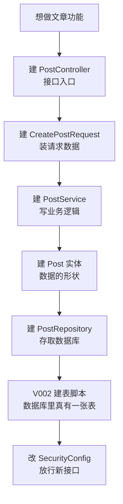
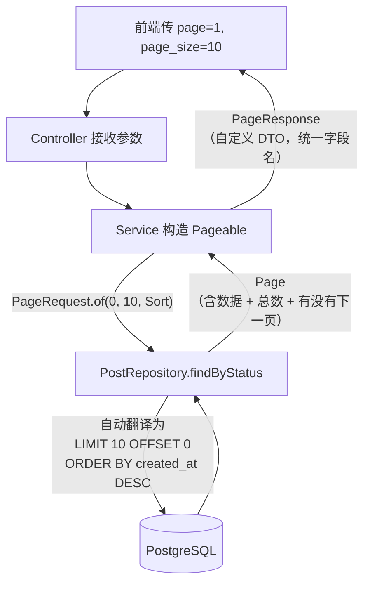
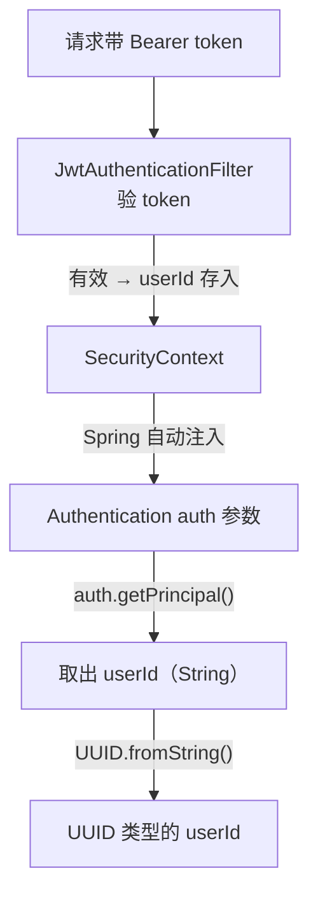
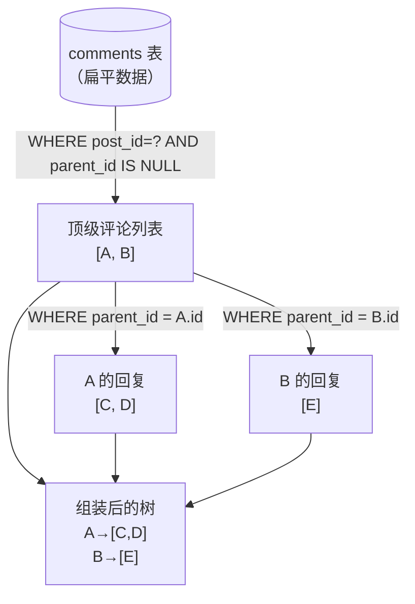
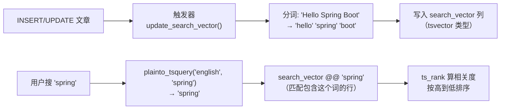
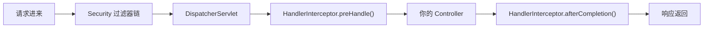
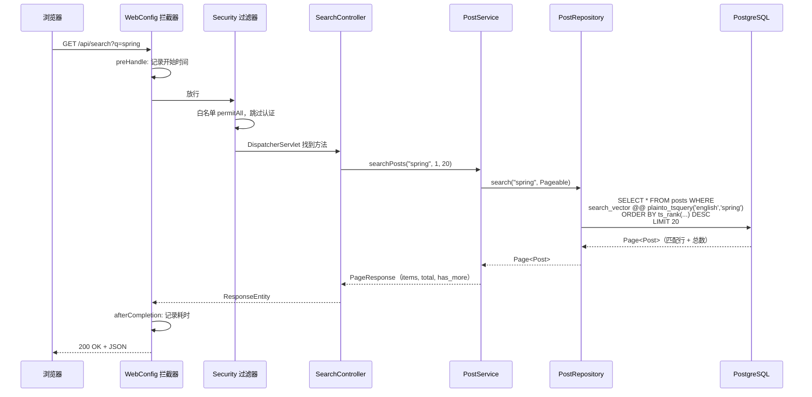

# Part 3 阶段总结：跟着「文章 + 评论」功能走一遍

> **这份文档的定位**：Part 1+2 的总结已经讲透了注册/登录的链路，本文**不重复那些内容**。
> 只写 Part 3 **新出现的模式**和**新踩的坑**——一对多映射、分页、全文搜索、评论树组装、请求日志拦截器。
> 每个技术点仍然只说「此刻它帮我们做了什么」，深入原理放进 `💡 深挖` 可选块。
>
> - 正文 = 主线，建议通读。
> - `💡 深挖` = 可选延伸，第一遍全跳过。
> - 所有流程图用 **mermaid** 画。

---

## 0. Part 3 和 Part 1+2 有什么不同

Part 1+2 的主线是「单表 CRUD」——users 表自己查自己存。Part 3 开始变复杂了：

| 新挑战 | Part 1+2 有没有 | Part 3 怎么解决 |
|--------|---------------|---------------|
| 一对多关系（用户→文章、文章→评论） | 没有，users 是孤表 | JPA 不建 `@OneToMany`，用 Service 层手动组装 |
| 分页查询 | 没有，一次全返回 | `Pageable` + `Page<T>` |
| 全文搜索 | 没有 | PostgreSQL tsvector + 触发器 |
| 同一资源按 HTTP 方法区分权限 | 没有，permitAll 一把梭 | `HttpMethod.GET` 限定只放行 GET |
| 评论树（顶级评论 + 嵌套回复） | 没有 | Service 分两步查：先查顶级，再查每个顶级的回复 |
| 请求日志 | 没有 | `HandlerInterceptor` 拦截器 |

一句话记住 Part 3 的核心变化：**从单表走向多表关联，从全量返回走向分页搜索。**

---

## 1. 主线：做「文章」功能

和注册一模一样的开发顺序——自顶向下，缺什么建什么：



下面只讲 Part 3 **新出现的写法**，和 Part 1+2 一样的（`@RestController`、构造器注入、`@Transactional` 等）不再重复。

### 1.1 新写法①：分页查询 — `Pageable` + `Page<T>`

**开发者的想法**：「文章列表不可能一次全返回，得分页。」

```java
// PostController
@GetMapping
public ResponseEntity<PageResponse<Map<String, Object>>> listPosts(
        @RequestParam(defaultValue = "published") String status,
        @RequestParam(defaultValue = "1") int page,
        @RequestParam(value = "page_size", defaultValue = "20") int pageSize) {
    return ResponseEntity.ok(postService.listPosts(status, page, pageSize));
}
```

```java
// PostService
public PageResponse<Map<String, Object>> listPosts(String status, int page, int pageSize) {
    Pageable pageable = PageRequest.of(page - 1, pageSize, Sort.by("createdAt").descending());
    Page<Post> postPage = postRepository.findByStatus(status, pageable);
    // ... 转成 PageResponse 返回
}
```

分页是怎么工作的：



此刻每个写法的作用：

| 写法 | 属于什么 | 此刻为我们做什么 |
|------|---------|-----------------|
| `PageRequest.of(page-1, pageSize, Sort)` | Spring Data | 把「第几页、每页多大、怎么排序」封装成一个对象。**注意 page 从 0 开始**，所以前端传 1 要减 1 |
| `Page<Post>` | Spring Data | 查询结果不只是一个 List，还附带 `getTotalElements()`（总数）、`hasNext()`（有没有下一页）等元信息 |
| `@RequestParam(value = "page_size")` | Spring MVC | 前端传 snake_case 的 `page_size`，Java 变量用 camelCase 的 `pageSize`，这个注解做桥梁 |

> 💡 深挖：`Page<T>` 内部执行了**两条 SQL**——一条查数据，一条 `SELECT COUNT(*)` 查总数。如果表很大，COUNT 会很慢，优化方案是「估算总数」或「游标分页」（`WHERE id < :lastId LIMIT 10`），但本项目文章量不大，不需要。

### 1.2 新写法②：分页响应 DTO — `PageResponse<T>`

**开发者的想法**：「Spring Data 返回的 `Page<T>` 字段名（`content`、`totalElements`）和前端约定的（`items`、`total`）对不上，我得转一层。」

```java
@Data @Builder
public class PageResponse<T> {
    @JsonProperty("items")
    private List<T> content;           // Java 字段叫 content，JSON 输出叫 items
    private int page;
    @JsonProperty("page_size")
    private int pageSize;              // JSON 输出叫 page_size（snake_case）
    private long total;
    @JsonProperty("has_more")
    private boolean hasMore;           // JSON 输出叫 has_more
}
```

| 写法 | 此刻为我们做什么 |
|------|-----------------|
| `@JsonProperty("items")` | Jackson 序列化时把 Java 字段名 `content` 映射成 JSON 键名 `items`，保证前后端字段名一致 |
| `@Data @Builder` | Lombok 生成 getter/setter + 链式创建 |

> **为什么不直接用 `Page<T>` 返回？** 因为 `Page` 序列化成 JSON 后字段名是 Spring 定的（`content`、`totalElements`、`number`），前端如果约定了 `items`/`total`/`page`，就对不上。DTO 就是这层翻译。

### 1.3 新写法③：增量修改 SecurityConfig — 按 HTTP 方法区分权限

**开发者的想法**：「文章列表和详情谁都能看（GET），但创建/修改/删除得登录。同一个 URL `/api/posts`，不同方法不同权限。」

```java
.authorizeHttpRequests(auth -> auth
    // ... 登录/注册等公开接口 ...
    .requestMatchers(HttpMethod.GET, "/api/posts/**").permitAll()   // 只放行 GET
    .requestMatchers(HttpMethod.GET, "/api/search/**").permitAll()
    .anyRequest().authenticated()                                    // POST/PUT/DELETE 都要登录
)
```

| 写法 | 此刻为我们做什么 |
|------|-----------------|
| `HttpMethod.GET` | `requestMatchers` 的重载形式：第一个参数限定 HTTP 方法，第二个参数匹配路径。只有 GET 请求才放行 |

> Part 1+2 的 SecurityConfig 是「整个路径要么全放行、要么全拦截」。Part 3 开始需要**同一路径按方法区分**——这是 REST API 的常见模式：GET = 读（公开），POST/PUT/DELETE = 写（需认证）。

### 1.4 新写法④：获取当前用户 + 校验作者权限

**开发者的想法**：「创建文章要知道『是谁发的』，删除文章要检查『是不是他的』。」

```java
// PostController — 从 SecurityContext 拿当前用户
@PostMapping
public ResponseEntity<Post> createPost(@Valid @RequestBody CreatePostRequest request,
                                       Authentication auth) {
    UUID userId = UUID.fromString((String) auth.getPrincipal());
    return ResponseEntity.ok(postService.createPost(userId, request));
}

// PostService — 校验作者
public void deletePost(UUID postId, UUID userId) {
    Post post = getPost(postId);
    if (!post.getAuthorId().equals(userId)) {
        throw new BusinessException(403, "Not the author");
    }
    postRepository.delete(post);
}
```



> ⚠️ **这里有个反复踩的坑**：`auth.getPrincipal()` 返回的是 **String**（JWT 的 subject），不能直接强转 `(UUID)`，必须 `UUID.fromString((String) auth.getPrincipal())`。Part 2 修 PostController 时改过一次，Part 3 的 CommentController 又漏了——**同类改动一定要全局搜索**。

---

## 2. 主线延伸：做「评论」功能

评论比文章多了一个维度：**嵌套**。一条评论可以有回复，回复还能有回复。这逼出了两个新模式。

### 2.1 新模式①：评论树组装（Service 层两步查）

**开发者的想法**：「评论要按树形展示——顶级评论排一排，每个下面挂回复。但数据库里所有评论是平的（每行一个 `parent_id`），我得在 Service 层把它组装成树。」

```java
public List<Comment> getCommentsForPost(UUID postId) {
    // 第一步：查出这篇博客的所有顶级评论（parent_id 为 null）
    List<Comment> topLevel = commentRepository
            .findByPostIdAndParentIdIsNullOrderByCreatedAtAsc(postId);
    // 第二步：为每个顶级评论加载它的直接回复
    for (Comment comment : topLevel) {
        List<Comment> replies = commentRepository
                .findByParentIdOrderByCreatedAtAsc(comment.getId());
        comment.setReplies(replies);    // 塞进 @Transient 字段，不存数据库
    }
    return topLevel;
}
```

评论树是怎么组装出来的：



此刻每个写法的作用：

| 写法 | 属于什么 | 此刻为我们做什么 |
|------|---------|-----------------|
| `findByPostIdAndParentIdIsNull...` | Spring Data 方法名派生 | 翻译成 `WHERE post_id=? AND parent_id IS NULL ORDER BY created_at ASC` |
| `@Transient replies` | JPA | 标记这个字段**不映射数据库列**，只在内存中存在。Service 查完数据库后手动填充 |
| `comment.setReplies(replies)` | 业务代码 | 把查到的回复塞进父评论的 `replies` 列表，Jackson 序列化时自动嵌套输出 |

> 💡 深挖：这种「先查顶级、循环查回复」的方式叫 **N+1 查询**——1 次查顶级 + N 次查回复。评论少的时候没问题；如果评论很多，优化方案是用 `@OneToMany` 让 JPA 一次性 JOIN 查出来，或者用一条 SQL 把所有评论全捞出来在内存里构建树。本项目评论量小，N+1 够用。

### 2.2 新模式②：可选的父级引用 — null 安全处理

**开发者的想法**：「发评论时，`parent_id` 是可选的——不传就是顶级评论，传了就是回复。」

```java
// CommentService
public Comment createComment(UUID postId, UUID authorId,
                             String content, String parentId) {
    Comment comment = Comment.builder()
            .postId(postId)
            .authorId(authorId)
            .content(content)
            .parentId(parentId != null ? UUID.fromString(parentId) : null)  // 关键：判空
            .isDeleted(false)
            .build();
    return commentRepository.save(comment);
}
```

Controller 里 `body.get("parent_id")` 在前端不传时返回 `null`。如果不判空就直接 `UUID.fromString(null)` → **NullPointerException → 500**。

> ⚠️ **这是 Part 3 验证时实际踩到的 500 错误之一**。文档里的代码是对的（有 null 判断），但实际源码漏了——再次说明要以文档为准、逐行核对。

---

## 3. 全文搜索 — PostgreSQL tsvector

**开发者的想法**：「用户搜 `spring`，我要在标题和内容里找包含这个词的文章，还得按相关度排序。」

这不是简单的 `LIKE '%spring%'`（那会全表扫描、没有排序）。PostgreSQL 内置了全文搜索引擎：

```sql
-- V002 建表时一并建好的结构：
-- ① 一个 tsvector 列（存储分词结果）
search_vector tsvector

-- ② 一个触发器（每次 INSERT/UPDATE 自动更新分词）
CREATE OR REPLACE FUNCTION update_search_vector() ...
    NEW.search_vector := to_tsvector('english', COALESCE(NEW.title, '') || ' ' || COALESCE(NEW.content, ''));

-- ③ 一个 GIN 索引（加速搜索）
CREATE INDEX idx_posts_search_vector ON posts USING GIN(search_vector);
```

```java
// PostRepository — 调用 PostgreSQL 全文搜索
@Query(value = "SELECT * FROM posts WHERE status = 'published' " +
       "AND search_vector @@ plainto_tsquery('english', :query) " +
       "ORDER BY ts_rank(search_vector, plainto_tsquery('english', :query)) DESC",
       nativeQuery = true)
Page<Post> search(String query, Pageable pageable);
```

全文搜索是怎么工作的：



此刻每个写法的作用：

| 写法 | 属于什么 | 此刻为我们做什么 |
|------|---------|-----------------|
| `tsvector` | PostgreSQL 类型 | 把文本预分词存起来，搜索时不用每次重新分词 |
| `to_tsvector('english', ...)` | PostgreSQL 函数 | 把文本按英文规则分词（去停用词、词干化） |
| `plainto_tsquery(...)` | PostgreSQL 函数 | 把用户输入转成搜索查询（自动处理空格分隔的多个词） |
| `@@` | PostgreSQL 操作符 | 左边 tsvector 是否匹配右边 tsquery |
| `ts_rank(...)` | PostgreSQL 函数 | 计算匹配的相关度分数（词频越高、位置越靠前，分越高） |
| `GIN 索引` | PostgreSQL 索引类型 | 倒排索引，让全文搜索不用全表扫描 |
| `nativeQuery = true` | Spring Data JPA | 这些是 PostgreSQL 专有函数，JPQL 不认识，必须写原生 SQL |

> 💡 深挖：`plainto_tsquery` 把输入当「纯文本」处理（空格分词、全部 AND）；还有一个 `to_tsquery` 支持 `&`（AND）、`|`（OR）、`!`（NOT）等布尔操作。本项目用 `plainto_tsquery` 更安全——用户输入什么搜什么，不会因特殊字符报错。另外 tsvector 的触发器只在 `title` 或 `content` 列变化时才更新（`BEFORE INSERT OR UPDATE OF title, content`），改其他列不触发。

---

## 4. 请求日志拦截器 — `HandlerInterceptor`

**开发者的想法**：「我想在每个请求进来时记一行日志（谁、什么路径），在请求结束时再记一行（耗时、状态码）。不想在每个 Controller 方法里手写。」

```java
@Configuration
public class WebConfig implements WebMvcConfigurer {

    @Override
    public void addInterceptors(InterceptorRegistry registry) {
        registry.addInterceptor(new RequestLogInterceptor());
    }

    private static class RequestLogInterceptor implements HandlerInterceptor {
        private static final Logger log = LoggerFactory.getLogger(RequestLogInterceptor.class);

        @Override
        public boolean preHandle(HttpServletRequest request,
                                 HttpServletResponse response, Object handler) {
            request.setAttribute("startTime", System.currentTimeMillis());
            log.info("→ {} {} from {}", request.getMethod(),
                    request.getRequestURI(), request.getRemoteAddr());
            return true;    // true = 继续往下走；false = 拦截掉
        }

        @Override
        public void afterCompletion(HttpServletRequest request,
                                    HttpServletResponse response,
                                    Object handler, Exception ex) {
            long start = (Long) request.getAttribute("startTime");
            long ms = System.currentTimeMillis() - start;
            log.info("← {} {} {}ms {}", request.getMethod(),
                    request.getRequestURI(), ms, response.getStatus());
        }
    }
}
```

拦截器在请求链路中的位置：



此刻每个写法的作用：

| 写法 | 属于什么 | 此刻为我们做什么 |
|------|---------|-----------------|
| `WebMvcConfigurer` | Spring MVC | 一个回调接口，让你在不覆盖 Spring Boot 默认配置的前提下**追加**自定义配置 |
| `addInterceptors(InterceptorRegistry)` | Spring MVC | 在注册器里挂上你的拦截器 |
| `HandlerInterceptor` | Spring MVC | 拦截器接口：`preHandle`（请求前）、`postHandle`（Controller 后、视图前）、`afterCompletion`（完成后，无论成功失败） |
| `request.setAttribute("startTime", ...)` | Servlet API | 把开始时间存在请求里，`afterCompletion` 再取出来算耗时 |

> 💡 深挖：拦截器和过滤器的区别——**过滤器**属于 Servlet 规范，在 Spring MVC 之前执行（Spring Security 就是过滤器）；**拦截器**属于 Spring MVC，在 DispatcherServlet 之后、Controller 前后执行，能拿到 `handler`（知道请求交给了哪个方法）。日志、鉴权、限流都常用拦截器。

> ⚠️ **注意参数类型**：`addInterceptors` 的参数是 `InterceptorRegistry`（注册器），不是 `InterceptorRegistration`（单个注册项）。IDE 自动补全容易选错，编译会直接报错。

---

## 5. 串联全景：一次搜索请求的完整链路



口述模板（Part 3 全链路）：

> 前端 GET `/api/posts` 或 `/api/search?q=xxx`，先过拦截器记开始时间，再过 Security 过滤器（GET 请求在 SecurityConfig 中被 `permitAll` 放行），DispatcherServlet 找到对应 Controller 方法。Controller 调 Service，Service 构造 `Pageable` 交给 Repository，Repository 的方法名或 `@Query` 被 Spring Data 翻译成 SQL——分页用 `LIMIT/OFFSET`，搜索用 `tsvector @@ plainto_tsquery`——查 PostgreSQL 拿到结果，包成 `PageResponse`（自定义 DTO，用 `@JsonProperty` 统一字段名）返回。写操作（POST/PUT/DELETE）需要 JWT 认证，Controller 从 `Authentication` 参数取出 userId 并校验作者权限。

---

## 6. 验证时发现的实际缺陷

> 以下每条都**对照当前真实代码核对过**。`java-blog/` 目录只读，只列问题和修法。

### 🔴 已导致 500 错误

| # | 位置 | 问题 | 后果 | 修法 |
|---|------|------|------|------|
| 1 | `SearchController.searchPosts` | 方法缺少 `@GetMapping` 注解 | Spring 不把它注册为 GET 端点，请求到达后无 handler → 500 | 方法上加 `@GetMapping` |
| 2 | `CommentService.createComment` | `parentId` 为 null 时直接调用 `UUID.fromString(null)` | NullPointerException → 500 | `parentId != null ? UUID.fromString(parentId) : null` |
| 3 | `CommentController.createComment` | `(UUID) auth.getPrincipal()` 强转 | JWT Principal 是 String，`ClassCastException` → 500 | `UUID.fromString((String) auth.getPrincipal())` |

> **规律**：Bug 1、2 是「文档写对了，代码没跟上」——敲代码时跳过了文档中已有的正确写法。Bug 3 和 Part 2 修 PostController 是同一个模式，当时只改了一处，CommentController 漏网。**同类改动要全局搜索，不能只修一处就认为完事。**

### 🟡 继承自 Part 1+2（上次已记录，此处不重复）

| # | 位置 | 问题 |
|---|------|------|
| 4 | `GlobalExceptionHandler` 的 `Exception` 兜底 | 吞掉非业务异常、不打日志、屏蔽 MVC 标准状态码 |
| 5 | `JwtAuthenticationFilter` 同时标 `@Component` + `addFilterBefore` | 过滤器可能执行两次 |

---

## 7. Part 3 新增的「已经建好但还没真正用上」的东西

| 类/方法 | 现状 | 何时会用到 |
|--------|------|----------|
| `PostRepository.findByTag` | 定义了按标签查文章的 `@Query`（用 `ANY(tags)` 原生 SQL） | 前端做「按标签筛选」功能时直接用 |
| `PostRepository.findByAuthorId` | 定义了按作者查文章 | 做「我的文章」页面时用 |
| `CommentRepository.findByPostIdOrderByCreatedAtAsc` | 查某篇文章全部评论（不区分顶级/回复） | 如果需要「平铺展示所有评论」的视图时用 |
| `Post.contentHtml` | 实体里有这个字段，但 Service 里没做 Markdown → HTML 转换 | Part 5 前端渲染时需要后端或前端做转换 |
| `WebConfig` 拦截器 | 只做了日志记录 | 后续加鉴权检查、跨域头注入等可在这里扩展 |

---

**文档说明**：本文对应 Part 3 的代码状态，已按当前真实代码和实际验证结果核对。采用与 Part 1+2 总结相同的「功能驱动、自顶向下」组织方式，只写 Part 3 新增内容，不重复注册/登录链路。
