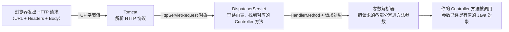
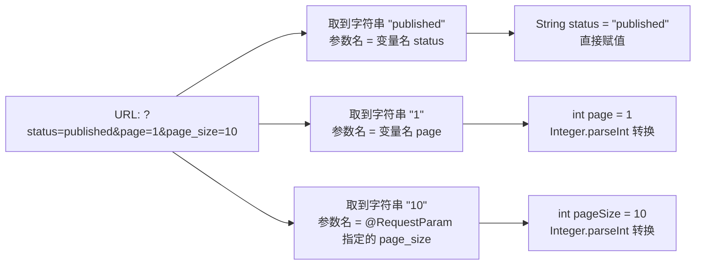
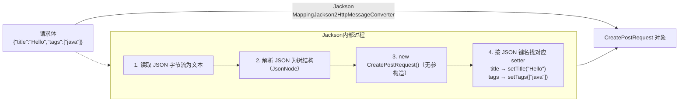
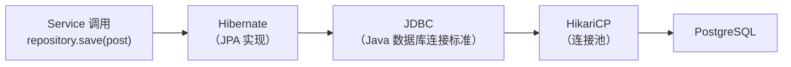
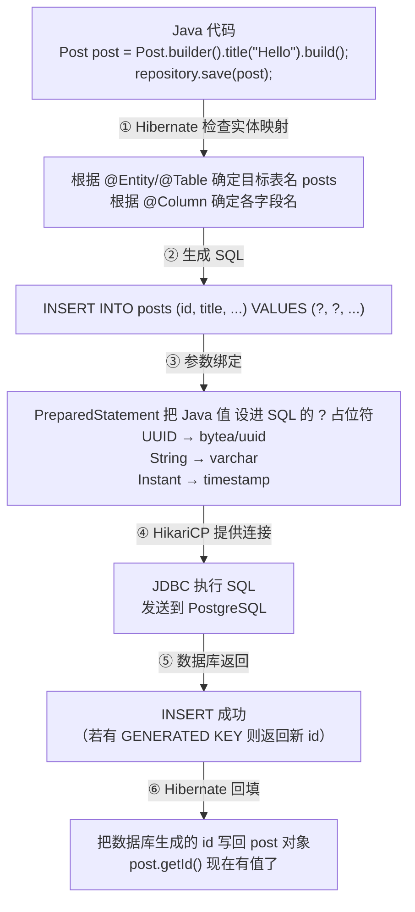
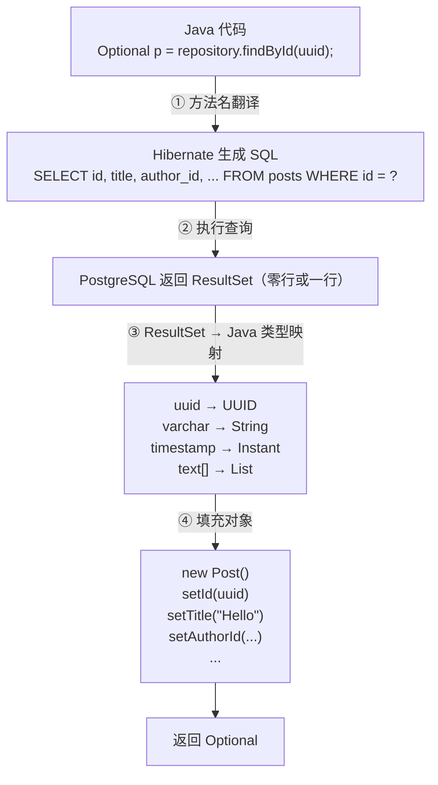

# java 项目总结文档

该文档是当前项目中所用技术、代码、内容等的个人总结，主要用来记录使用的方式。

---

# 〇、浏览器到Java流程认知

`https://myblog.local:4443` 这个请求分两种情况：**页面本身和页面里发出的 API 调用** —— 后端 Java 代码只能“感知”到后者。

## 0. 4443 端口先落到 nginx 容器，不是 Java

[docker-compose.yml](../../java-blog/docker/docker-compose.yml)

- nginx 服务映射了 [${HTTPS_PORT:-4443}:443](../../java-blog/docker/docker-compose.yml#L141)
  —— 浏览器连 `IP:4443`，Dokcer 把包转发进 nginx 容器的 `443`。
- 所以**第一个收到请求的进程是 nginx，Java 此时完全不知情**

[nginx.conf](../../java-blog/nginx/nginx.conf)

[`listen 443 ssl`](../../java-blog/nginx/nginx.conf#L56) 做 TLS 解密，然后**按 URL 路径分流** —— 这是后端“被知道”的唯一入口条件：
| 浏览器请求的路径 | nginx 转发到 | 谁处理 |
|-----------------|-------------|--------|
| `/`（首页、文章页等）| `http://frontend:80` | 前端 nginx，**Java 不参与** |
| `/api/**` | `http://backend:8080` | **Spring Boot** |
| `/ws/**` | `http://backend:8080`（带 Upgrade 头） | **Spring Boot WebSocket** |


前端：
React 里 `axios` 请求都写成 `/api/xxx` 开头（见 [axios.ts](../../java-blog/frontend/src/api/axios.ts)），`/api` 这个前缀就是“触发后端”的开关。
访问 `https://myblog.local:4443` 看到的 HTML 页面本身根本不经过 Java —— Java 是在浏览器加载完 JS 后、JS 发起 `/api/posts?...` 这类请求时才第一次收到包。

## 1. 请求被 Java “知道”
backend 容器[映射了 8080](../../java-blog/docker/docker-compose.yml#L108-L109)，nginx 把 `/api/posts` 的包原样转发到 `backend:8080`。此时进入 Spring Boot 进程，顺序是：
1. **内嵌 Tomcat 监听 8080**（server.port: 8080，Spring Boot 默认，application.yml 没改它），收包、解析出 HTTP 报文：方法(GET/POST)、路径(`/api/posts`)、Header(`Authorization`、`Content-Type`)、Body。
2. **Security 过滤器链**：[SecurityConfig.filterChain()](../../java-blog/backend/src/main/java/com/blog/config/SecurityConfig.java#L40-L61) 这段代码就是 **“安检名单”** ——
   - `/api/posts/**` 的 GET 是 [permitAll()](../../java-blog/backend/src/main/java/com/blog/config/SecurityConfig.java#L51) 直接放行；
   - `/api/posts/my-posts`、**所有 POST/PUT/DELETE** 走 [anyRequest().authenticated()](../../java-blog/backend/src/main/java/com/blog/config/SecurityConfig.java#L57)，没登录就在这里被拒(401/403)，**根本到不了 Controller**。
3. [JwtAuthenticationFilter](../../java-blog/backend/src/main/java/com/blog/security/JwtAuthenticationFilter.java#L30-L53)：从 `Authorization: Bearer xxx` 头里扣出 token，验签、解出 `userId` 塞进 `SecurityContextHolder`。这一步决定了后面 Controller 里的 `auth.getPrincipal()` 能不能拿到“你是谁”。
4. DispatcherServlet 按路径找方法：这就是“如何知道返回什么”的第一半答案 —— URL 到 Java 方法的映射完全是注解写死的：
    ```java
    @RestController
    @RequestMapping("/api/posts")      // ← nginx 转来的路径 /api/posts 匹配到这里
    public class PostController {
        @GetMapping                    // ← GET 方法 → listPosts()
        @GetMapping("/{id}")           // ← GET /api/posts/3f2a... → getPost()
        @PostMapping                   // ← POST /api/posts → createPost()
    ```

比如浏览器(React)发 `GET /api/posts?page=1&page_size=20`，命中的就是 [listPosts()](../../java-blog/backend/src/main/java/com/blog/controller/PostController.java#L30)，page_size 由 `RequestParam(value = "page_size")` 接进 pageSize 参数，路径里的 [`{id}` 由 `@PathVariable`](../../java-blog/backend/src/main/java/com/blog/controller/PostController.java#L50) 接住

## 2. 返回什么内容由谁决定
沿着 [listPosts()](../../java-blog/backend/src/main/java/com/blog/controller/PostController.java#L30) 往下：
- **数据内容**：`postService.listPosts(...)` → Repository 查 PostgreSQL → 组装成 `PageResponse<Map<String,Object>>`
- **JSON 格式**：方法上的 [@RestController](../../java-blog/backend/src/main/java/com/blog/controller/PostController.java#L15) (= `@Controller` + `@ResponseBody`) 告诉 Spring：返回值不要当页面渲染，直接用 Jackson 序列化成 JSON 写进响应体，`Content-Type: application/json`
- **HTTP 状态码**：`ResponseEntity.ok(...)`=200；[GlobalExceptionHandler](../../java-blog/backend/src/main/java/com/blog/exception/GlobalExceptionHandler.java) 里声明的异常映射决定出错时返回什么码和什么 JSON

响应沿原路返回：Tomcat 写出字节 → nginx 收到后回给浏览器（HTTPS 场景由 nginx 重新加密） → 浏览器 JS 拿到 JSON。
**nginx 和 Java 都不“记住”这个请求** —— [`SessionCreationPolicy.STATELESS`](../../java-blog/backend/src/main/java/com/blog/config/SecurityConfig.java#L45) 就是这个意思，下一个请求来了全部从头再走一遍。


## 例外：WebSocket（聊天）
`wss://myblog.local:4443/ws/chat`（docker-compose 里构建时注入给前端的 [VITE_WS_URL](../../java-blog/docker/docker-compose.yml#L126-L128)）走 nginx 的 [`location /ws/`，那段配置](../../java-blog/nginx/nginx.conf#L92-L105)把 HTTP 请求头改写成 WebSocket 升级握手转发给 8080。Java 侧由 [WebSocketConfig](../../java-blog/backend/src/main/java/com/blog/config/WebSocketConfig.java) 注册 `/ws/chat` → `ChatWebSocketHandler`，这条链路不是“一问一答”，连接建立后 Java 可以主动往这条 TCP 连接里推消息 —— 这是它和上面 `/api` 流程的本质区别。

---

# 一、Spring Boot

## 1. `@SpringBootApplication` （核心组合注解）
这是 Spring Boot 的灵魂注解，它实际上是一个**组合注解**(Meta-Annotation)，封装了以下三个关键功能：

| 内涵注解 | 作用 | 详解 |
|---|---|---|
| `@Configuration` | 配置类标识 | 声明这是一个 Java Config 配置类，等同于传统的 XML 配置文件。允许在类中使用 `@Bean` 定义|
| `@EnableAutoConfiguration` | **自动配置** | **Spring Boot** 最核心的魔法。它会根据 classpath 下的依赖（如引入了 `spring-boot-starter-web`）自动推断并注册响应的 Bean（如DispatcherServlet、内嵌Tomcat等），实现“开箱即用” |
| `@ComponentScan` | 组件扫描 | 默认扫描**当前类所在包及其子包**下的所有组件（`@Controller`, `@Service`, `@Repository`, `@Component` 等） |

> ⚠️重要约定：由于 `@ComponentScan` 默认从启动类所在包开始向下扫描，因此**启动类必须放在项目的根包下**（如`com.blog`）。如果你的 Controller/Service 放在了 `com.other` 包下，将不会被自动扫描到，除非手动指定 `scanBasePackages`。

### 1.1 结构说明
比如包目录结构如下：
```plaintext
src/main/java/
└── com/
    ├── blog/                        ← 根包（启动类所在包）
    │   ├── Application.java         ← @SpringBootApplication 启动类
    │   ├── controller/
    │   │   └── HealthController.java    ✅ 被扫描
    │   ├── service/
    │   │   └── UserService.java         ✅ 被扫描
    │   ├── repository/
    │   │   └── UserRepository.java      ✅ 被扫描
    │   └── exception/
    │       ├── BusinessException.java   ✅ 被扫描
    │       └── GlobalExceptionHandler.java  ✅ 被扫描
    │
    └── other/                       ← 与 com.blog 平级的其他包
        └── SomeController.java          ❌ 不会被扫描
```
`com.blog`下的`Application.java`中写有`@SpringBootApplication`，则`Application.java`所在目录（`com.blog`）及其所有子目录（`controller`、`service`、`repository`、`exception` 等）中的组件都会被扫描并注册为 Bean；而与 `com.blog` 平级的 `com.other` 包不在扫描范围内，其中的组件不会被自动发现。

### 1.2 使用说明

启动类只需标注 `@SpringBootApplication`，并在 `main` 方法中调用 `SpringApplication.run(...)` 即可拉起整个应用：

```java
package com.blog;

// ...

@SpringBootApplication            // 组合注解：配置类 + 自动配置 + 组件扫描
public class Application {
    public static void main(String[] args) {
        SpringApplication.run(Application.class, args);  // 启动内嵌容器并初始化 Spring 容器
    }
}
```

启动后，`com.blog` 包下被 `@RestController`、`@Service` 等标注的组件会被自动扫描并注册为 Bean，无需额外配置即可生效：

```java
package com.blog.controller;   // 位于启动类所在包 com.blog 的子包，会被自动扫描

@RestController                // 被 @ComponentScan 发现并注册为 Bean
@RequestMapping("/api")        // 类级别公共路径前缀
public class HealthController {

    @GetMapping("/health")     // 完整路径 = 类前缀 + 方法路径 = /api/health
    public ResponseEntity<Map<String, Object>> health() {
        return ResponseEntity.ok(Map.of(
                "status", "UP",
                "timestamp", Instant.now().toString(),
                "service", "blog-platform"
        ));
    }
}
```

> **关于返回类型 `ResponseEntity<Map<String, Object>>`**：本项目中 Controller 的接口**并非全部**返回 `ResponseEntity<Map<String, Object>>` 类型。`HealthController` 之所以这样写，是因为健康检查接口需要在一个响应体里同时返回多个字段（`status`、`timestamp`、`service`），所以用 `Map<String, Object>` 组装一个灵活的 JSON 对象，再用 `ResponseEntity.ok(...)` 包装成 HTTP 200 响应。其他业务接口（如文章、用户、评论等）通常返回**自定义 DTO 对象**（如 `PostResponse`、`LoginResponse`）或直接返回 `ResponseEntity<XxxDTO>`，类型由具体业务决定，不统一使用 `Map`。

**使用说明**：`@SpringBootApplication` 是一个**类级注解**（`@Target(ElementType.TYPE)`），只能标注在类上，不能标注在方法或字段上。有几个的关键点：
1. **不强制与 `main` 同类**：注解标注的类和 `main()` 所在的类可以是两个不同的类。`main()` 只是 JVM 入口，真正决定应用行为的是 `SpringApplication.run(Xxx.class, args)` 的第一个参数。
2. **`run()` 的参数才是“主配置源”**：`run(Xxx.class, ...)` 中的 `Xxx` 必须是标注了 `@SpringBootApplication`（或等价 `@Configuration`）的类，它的**包路径决定了组件扫描的起点**。也就是说“扫哪个包”取决于传给 `run()` 的类，而不是 `main()` 所在的类（只是习惯上两者写在同一个类里）。
3. **通常只放一个**：一个应用一般只保留一个 `@SpringBootApplication` 启动类；若在同一扫描路径下存在多个，容易引发自动配置重复、Bean 定义冲突等问题。
4. **类需 `public` 且非 `final`**：因为它内含 `@Configuration`，Spring 会用 CGLIB 为其生成代理，所以标注的类不应是 `final`，其中的 `@Bean` 方法也不能是 `private`/`final`。
5. **只能有一个入口实例**：`SpringApplication.run()` 会创建一个独立的 Spring 容器，不要在同一个应用中多次调用它来“重启”或叠加容器，否则会得到多个互不相干的上下文。


## 2. `@EnableScheduling`（定时任务支持）
这个注解用于**开启Spring的定时任务调度功能**。
**作用**：激活 Spring 容器中的任务调度器(TaskScheduler)，使得 `@Scheduled` 注解生效。
**使用方法**：加上此注解后，可以在任意 Spring Bean 的方法上使用 `@Scheduled`
```java
@Component
public class BlogCleaner {

    // 每5分钟执行一次清理草稿
    @Scheduled(fixedRate = 300000)
    public void cleanDrafts() {
        System.out.println("清理过期草稿...");
    }

    // Cron 表达式：每天凌晨2点归档文章
    @Scheduled(cron = "0 0 2 * * ?")
    public void archivePosts() {
        System.out.println("归档旧文章...");
    }
}
```

**底层机制**：Spring会创建一个 `TaskScheduler` Bean（默认单线程的 `ThreadPoolTaskScheduler`），在应用启动完成后，解析所有带 `@Scheduled` 的方法并按策略触发执行。
**生产建议**：默认的调度器只有**1个线程**，如果某个定时任务阻塞，其他任务都会延迟。生产环境建议自定义线程池。
```java
@Bean
public TaskScheduler taskScheduler() {
    ThreadPoolTaskScheduler scheduler = new ThreadPoolTaskScheduler();
    scheduler.setPoolSize(4);   // 设置线程数
    scheduler.setThreadNamePrefix("scheduled-task-");
    return scheduler;
}
```


## 3. `SpringApplication.run()`（启动入口）
```java
SpringApplication.run(Application.class, args);
```
这一行代码完成了整个应用的引导（Bootstrap）过程，内部依次执行：
1. **创建 ApplicationContext**：根据 Web 类型选择对应的容器（Servlet / Reactive / Standard）
2. **加载 Environment**：读取 application.yml/properties、环境变量、命令行参数
3. **执行 AutoConfiguration**：通过 spring.factories / AutoConfiguration.imports 加载自动配置类
4. **刷新容器 (refresh)**：实例化所有单例 Bean、初始化 MVC、连接数据库、启动内嵌 Web 服务器
5. **发布 ApplicationStartedEvent**：通知监听器应用已就绪

---

# 二、HTTP 请求数据如何变成 Java 方法参数

一个前端请求从「网络字节流」变成「Controller 方法里的 Java 变量」，中间经过了三层转换。每一层各管一件事：



## 1. Tomcat：字节流 → `HttpServletRequest`

Tomcat 监听 8080 端口，收到 TCP 字节流后按 HTTP 协议解析，封装成一个 `HttpServletRequest` 对象。这个对象把 HTTP 请求的各个部分拆成了独立的 API：

| HTTP 原始数据 | `HttpServletRequest` 提供的 API | 举例 |
|---|---|---|
| 请求行 `GET /api/posts?page=1` | `getRequestURI()` / `getMethod()` | `/api/posts` / `GET` |
| 查询字符串 `?page=1&page_size=10` | `getParameter("page")` | `"1"` |
| 请求头 `Authorization: Bearer xxx` | `getHeader("Authorization")` | `"Bearer xxx"` |
| 请求体 `{"title":"Hello"}` | `getInputStream()` | 字节流 |

此时所有数据都是**字符串或字节流**——Tomcat 不懂你的业务类型，它只负责拆包。

## 2. DispatcherServlet：找到该调哪个方法

DispatcherServlet 拿着请求 URI（`/api/posts`）+ HTTP 方法（`GET`）去启动时建好的「路由表」（所有 `@RequestMapping` / `@GetMapping` 等注解注册的路径映射）里匹配，找到对应的 Controller 方法（`HandlerMethod`）。

这一步只解决了「交给谁」，还没解决「参数怎么填」。

## 3. 参数放 URL 还是 JSON：前后端的接口契约

在讲参数解析之前，先明确一个根本问题：**哪些参数放 URL 查询字符串，哪些放请求体 JSON？这不是技术限制，而是前后端商量好的 REST 设计惯例。**

| HTTP 方法 | 参数放哪 | 为什么 | 后端用什么注解接 |
|---|---|---|---|
| **GET** | URL 查询字符串 `?key=value` | GET 请求**没有请求体**（HTTP 规范不允许），参数只能放 URL 里 | `@RequestParam` |
| **POST / PUT** | 请求体 JSON | 数据可能很复杂（嵌套对象、数组、长文本），放 URL 太长且不规范 | `@RequestBody` |
| **DELETE / 带 id 的 GET** | URL 路径 `{id}` | 只需要一个资源标识，没必要带请求体 | `@PathVariable` |

> 理论上 GET 可以带请求体、POST 也可以把参数放 URL，但实际上：浏览器/代理服务器可能忽略 GET 的请求体；URL 有长度限制（2-8KB）且无法表达嵌套结构。所以业界统一按上表的惯例来。

## 4. 参数解析器：请求的各部分 → 方法参数值

Spring MVC 为 Controller 方法的每个参数分配一个**参数解析器**（`HandlerMethodArgumentResolver`），根据参数上的注解决定从请求的哪个部分取值、怎么转换：

| 注解 | 从请求的哪里取值 | 转换过程 | 项目中的例子 |
|---|---|---|---|
| `@RequestParam` | URL 查询字符串 `?page=1` | 按参数名从 URL 取字符串 → 按变量类型自动转（`String→int` 等） | `@RequestParam(defaultValue = "1") int page` |
| `@PathVariable` | URL 路径中的 `{id}` 部分 | 从路径模板提取字符串 → 按类型转换 | `@PathVariable UUID id` |
| `@RequestBody` | 请求体（JSON） | **Jackson** 按 JSON 键名匹配 Java 字段名 → 调 setter 填充对象 | `@RequestBody CreatePostRequest request` |
| `@RequestHeader` | 请求头 | `request.getHeader(...)` → 按类型转换 | `@RequestHeader("Authorization") String auth` |
| 无注解的 `Authentication` | Spring Security 上下文 | 从 `SecurityContextHolder`（ThreadLocal）取出当前登录信息直接注入 | `Authentication auth` |

### 4.1 `@RequestParam`：从 URL 查询字符串取值

前端发 `GET /api/posts?status=published&page=1&page_size=10`，Spring 逐个参数从 URL 里按名字取：



**名字匹配规则**：

| 写法 | Spring 去 URL 里找什么 | 说明 |
|---|---|---|
| `@RequestParam int page` | `?page=...` | 没写 `value`，默认用 **Java 变量名** `page` |
| `@RequestParam(value = "page_size") int pageSize` | `?page_size=...` | 写了 `value`，用**注解指定的名字** `page_size`，和变量名 `pageSize` 无关 |

URL 里取出来的永远是**字符串**，Spring 按参数声明的类型自动转。`?page=abc` 转 `int` 失败 → 400。

### 4.2 `@RequestBody`：从请求体 JSON 取值

前端发 `POST /api/posts`，Body 为 `{"title":"Hello","tags":["java"]}`。`@RequestBody` 告诉 Spring：「这个参数的值，请从请求体里取」。Spring 看到注解后，调用 **Jackson** 完成 JSON → Java 对象的转换：



**名字匹配规则**：Jackson 按 JSON 键名找 Java 的 setter 方法。JSON 键名必须和 **Java 字段名严格一致**（大小写、分隔符都要对）：

| 前端发的 JSON 键名 | Java 字段 | 结果 |
|---|---|---|
| `"title"` | `private String title` | ✅ 匹配，`setTitle("...")` 被调用 |
| `"Title"` | `private String title` | ❌ 大小写不对，`title` 留 null |
| `"cover_image"` | `private String coverImage` | ❌ 下划线 vs 驼峰不对，`coverImage` 留 null |
| `"coverImage"` | `private String coverImage` | ✅ 匹配 |

> 如果 JSON 键名和 Java 字段名不同，可以用 `@JsonProperty("cover_image")` 显式指定映射。但本项目前后端统一用 camelCase，所以不需要。

**关键前提**：目标类必须有**无参构造器**（`@NoArgsConstructor`）和 **setter**（`@Data` 或手写），否则 Jackson 无法创建和填充对象。这就是为什么 DTO 类都标 `@Data`，而实体类标 `@Getter @Setter @NoArgsConstructor`。

### 4.3 类型转换失败会怎样

| 场景 | 结果 |
|---|---|
| `@RequestParam` 的 `?page=abc` 但参数类型是 `int` | 抛 `TypeMismatchException` → 400 |
| `@RequestBody` 的 JSON 缺少 `@NotBlank` 字段 | `@Valid` 校验失败 → 抛 `MethodArgumentNotValidException` → 400 |
| `@PathVariable` 的 `{id}` 不是合法 UUID | 抛 `MethodArgumentTypeMismatchException` → 400 |
| 请求体 JSON 格式错误 | Jackson 抛 `HttpMessageNotReadableException` → 400 |
| JSON 键名和 Java 字段名不匹配 | **不报错**，该字段留 null（如果标了 `@NotBlank` 则在校验阶段报 400） |

所有这些异常都会被 `GlobalExceptionHandler` 中对应的 `@ExceptionHandler` 接住，转成干净的 JSON 错误响应返回给前端。

### 一句话总结

> 浏览器发出 HTTP 请求 → Tomcat 解析成 `HttpServletRequest` → DispatcherServlet 按路径找到 Controller 方法 → 参数解析器根据注解从请求的不同部分取值：`@RequestParam` 从 URL 查询字符串按名字取并自动转类型，`@RequestBody` 由 Jackson 按 JSON 键名匹配 Java 字段名并通过 setter 填充对象，`@PathVariable` 从 URL 路径模板提取值。**前端 JSON 的键名必须和 Java 字段名一致**（这是前后端的接口契约），否则字段会被静默忽略留 null。

---

# 三、Java 如何与数据库交互

Java 和数据库之间的数据流转同样经过多层转换。核心问题是：**Java 操作的是对象，数据库操作的是行和列，两者之间需要双向翻译。**

## 1. 连接：Java 怎么连上数据库



| 层 | 它做什么 | 项目中的配置 |
|---|---|---|
| **JDBC** | Java 访问数据库的标准 API（`java.sql.*`），定义了 `Connection`、`PreparedStatement`、`ResultSet` 等接口 | 不直接写，由下层自动使用 |
| **HikariCP** | 连接池——启动时创建一批 `Connection` 放在池里，用的时候取、用完放回，避免每次请求都新建连接（新建连接要 TCP 三次握手 + 认证，很慢） | `spring.datasource.*` 配置了 URL、用户名、密码，Spring Boot 自动配 HikariCP |
| **Hibernate** | JPA 的实现——把 Java 对象的操作翻译成 SQL 语句，把数据库返回的行翻译回 Java 对象 | `@Entity`、`@Table`、`@Column` 等注解告诉 Hibernate 怎么映射 |
| **Spring Data JPA** | 在 Hibernate 之上再封装——你连 SQL 都不用写，只写方法名或 `@Query`，它帮你生成 | `extends JpaRepository<Post, UUID>` |

## 2. 写数据：Java 对象 → SQL 语句 → 数据库

以 `postRepository.save(post)` 为例：



每一步的关键：

| 步骤 | 谁负责 | 做了什么 |
|---|---|---|
| ① 实体映射 | Hibernate | 读 `@Table(name="posts")` 知道存到哪张表，读 `@Column(name="title")` 知道字段对应关系 |
| ② 生成 SQL | Hibernate | 根据实体字段值和映射关系，拼出完整的 INSERT/UPDATE 语句 |
| ③ 参数绑定 | Hibernate + JDBC | 用 `PreparedStatement` 设参数（**不用字符串拼接，防止 SQL 注入**） |
| ④ 连接获取 | HikariCP | 从池里取一个空闲连接，没有就新建 |
| ⑤ 执行 | PostgreSQL | 真正执行 SQL，写入数据 |
| ⑥ 结果回填 | Hibernate | 把数据库返回的自增 id / 默认值写回 Java 对象 |

## 3. 读数据：数据库行 → Java 对象

以 `postRepository.findById(id)` 为例：



数据库列类型和 Java 类型的对应关系：

| PostgreSQL 列类型 | Java 类型 | 映射依据 |
|---|---|---|
| `uuid` | `java.util.UUID` | `@Column(columnDefinition = "uuid")` |
| `varchar` / `text` | `java.lang.String` | `@Column` 自动推断 |
| `timestamp with time zone` | `java.time.Instant` | Hibernate 6 自动映射 |
| `integer` | `java.lang.Integer` | 自动推断 |
| `boolean` | `java.lang.Boolean` | 自动推断 |
| `text[]`（数组） | `java.util.List<String>` | Hibernate 6 自动映射 PostgreSQL 数组 |

> ⚠️ **`columnDefinition = "uuid"` 必须写**：如果不写，Hibernate 的 `ddl-auto: validate` 会把 `UUID` 类型推导成 `bytea`，和数据库实际的 `uuid` 列对不上，启动直接报错。

## 4. Spring Data 的方法名 → SQL 翻译

你只写方法名，Spring Data 自动翻译成 SQL：

```java
// 方法名
List<Comment> findByPostIdAndParentIdIsNullOrderByCreatedAtAsc(UUID postId);

// 翻译出的 SQL
SELECT * FROM comments
WHERE post_id = ? AND parent_id IS NULL
ORDER BY created_at ASC
```

翻译规则：

| 方法名关键字 | 翻译成的 SQL | 举例 |
|---|---|---|
| `findBy` | `SELECT * FROM ... WHERE` | 所有查询的开头 |
| `And` / `Or` | `AND` / `OR` | `findByTitleAndStatus` → `WHERE title=? AND status=?` |
| `IsNull` | `IS NULL` | `findByParentIdIsNull` → `WHERE parent_id IS NULL` |
| `OrderBy...Asc/Desc` | `ORDER BY ... ASC/DESC` | `OrderByCreatedAtAsc` → `ORDER BY created_at ASC` |
| `CountBy` | `SELECT COUNT(*)` | `countByStatus` → `SELECT COUNT(*) WHERE status=?` |
| `findBy...In` | `WHERE ... IN (...)` | `findByIdIn(List)` → `WHERE id IN (?, ?, ?)` |

对于复杂查询（如全文搜索），方法名无法表达，用 `@Query(nativeQuery = true)` 直接写原生 SQL。

## 5. 一句话总结

> Java 通过 HikariCP 连接池持有 PostgreSQL 连接；Service 调用 Repository 方法时，Spring Data 按方法名或 `@Query` 生成 SQL，Hibernate 把 Java 对象的字段值绑定到 SQL 参数上（类型映射由 JPA 注解决定），经 JDBC 发送给 PostgreSQL 执行；数据库返回的 ResultSet 再由 Hibernate 按列类型→Java 类型的映射表逐行填充成 Java 对象返回给 Service。整个过程你只操作 Java 对象，SQL 由框架自动生成和执行。